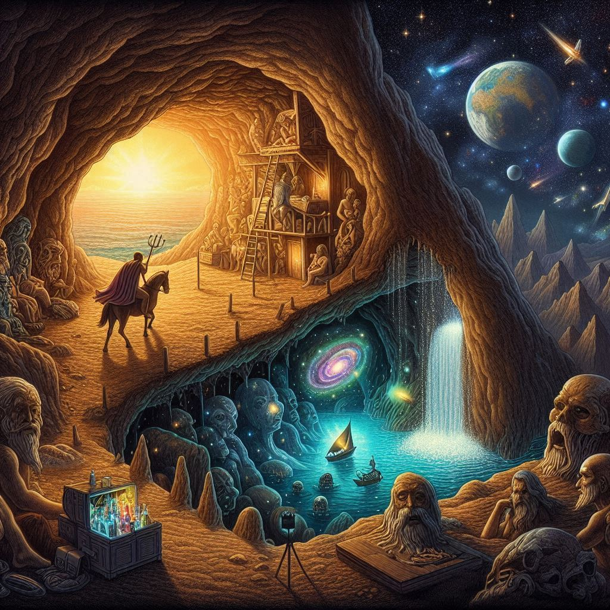

# The Cave Code
This projects tries to create an simulation of our world. Disclaimer: This is just a fun project created from curiosity.

- [Project Name](#project-name)
- [Idea](#idea)
- [Tools](#tools)
- [Plan](#plan)
- [Expected Limitations](#expected-limitations)
- [Possibilities of realization](#possibilities-of-realization)
- [Ask AI](#ask-ai)
    - [Ask ChatGPT](#ask-chatgpt)
    - [Ask Copilot](#ask-copilot)
    - [Ask Gemini](#ask-gemini)
- [Plan B](#plan-b)


</img>


### Project Name
The project names comes from [the cave allegory from plato](https://en.wikipedia.org/wiki/Allegory_of_the_cave). From the wikipedia entry: "In the allegory, Plato describes people who have spent their lives chained in a cave facing a blank wall. They watch shadows projected onto the wall by objects passing in front of a fire behind them, and they give names to these shadows. The shadows are the prisoners' reality but not accurate representations of the real world. The shadows represent the fragment of reality that we can normally perceive through our senses, while the objects under the sun represent the true forms of objects that we can only perceive through reason. Three higher levels exist: natural science; deductive mathematics, geometry, and logic; and the theory of forms.". In this project I take this idea further and interpret it a bit different. Also is my goal not to escape the cave or claim that we live in a cave. I want to try to build such a "cave" in a digital way. Why? The reason is explained [here](#idea).<br>I interpret the cave as a simulated world inside of an world. (Of course this is just for this project and I don't believe that this was the original idea from plato)


### Idea
Imagine you would create an Big Bang in your computer. Simulating all atoms and all rules. Then it maybe would be possible to simulate everything. And this could possible give answers to nearly every question. Just let them answer by another simulated digital species.<br>So with simulating the start and rules of the universe everything could be possible without further work...maybe just a search task. For a question you have search in digital time and space to find the answer, which can be also a big task, but given the possible answer the work is really worth it.<br>Also just for entertainment it could be so impressive. Incredible stories of live and astronomy and everything could lead out from this.<br><br>The possibilities from a working realistic simulation are endless and I could write pages over pages what we all could learn and gain from such a technology/software. But I think it's fine for now, else you get bored.<br>The idea and motivation should be clear.


### Tools
For this big project my choice of programming language is [C++](https://en.wikipedia.org/wiki/C%2B%2B). I would also refere to the [original author of C++ page, Bjarne Stroustrup](https://stroustrup.com/C++.html) and [his great book as reference](https://stroustrup.com/4th.html) and [this](https://stroustrup.com/tour3.html).<br>The reason of C++ is the good performance and because I like C++.

Other used tools will be added here...(FIXME)


### Plan
- program accurate atoms and molecules
- program rules of chemistry
- program rules
    - gravity
    - electricity
    - magnetism
    - ...
- create digital big bang 


### Expected Limitations
This incredible Project is really amazing and if it would really work then it would be more than just amazing. It would be "game changing". But sadly there is a but. 

There are different limitations and challenges which are huge. 

1. **Hardware Resources**
    This project needs a huge and I mean a really huge amount of hardware resource. <br>Assuming our universe has $10^85$ atoms ([reference](https://www.swr.de/wissen/1000-antworten/wie-viele-atome-gibt-es-im-universum-100.html)) and assuming we need 544 Bits to representate an atom (atomic number 32 bits + isotope 32 bits + electron configuration 128 bits + quantum states 224 bits + position and momentum 128 bits), then we would need an storage of $5.44\times10^{87}$ Bits or $6.8\times10^{62}$ [Yottabytes](https://www.techtarget.com/searchstorage/definition/yottabyte). And our universe has even more informations, like energies and forces. And if time comes into play then the computional expenses get even higher. And it get even more frightening if you recall that [just 5% of all matter is just ordianry mass, the rest is dark matter and dark energy](https://en.wikipedia.org/wiki/Dark_matter).

2. **Lack of knowledge**
    To succefully create such an simulation we would need an representation of atoms which have nearly 100% information like the real atoms. Also we would need a nearly perfect representation of the real interaction from atoms and also all existings rules, forces and energies which exist.<br>Which leads to the problem that we don't even know everything about our universe yet. Dark Matter, dark energy, black holes and more... (not to mention my own ignorance in these topics 🤷‍♂️).<br>This lack of knowledge how these meta principles works could lead to the failure of the project.

3. **Hardware Limitations**
    Last it is questionable if a computer could even simulate everything. There might be processes which can't be simulated accurate enough, because of the limitations that it is just a computer and bound on our world rules.<br>I think here most on quantum phenomens, which maybe can't be simulated. Real randomness propably only exist in the quantum world and the question is if this is needed

4. **Open Questions**
    There are many open questions and propably challenges which can't be seen yet. Like how accurate must the simulation be, to work and build a "real" living digital world? And how much matter does this universe really needs to work? Maybe the simulation works with much less matter but then the possibilities might be strongly limited. And there are multiple models for the physics in our universe. Should we implement the string theory...or the standard atoms?<br>Such and more questions about our universe and simulations are also a big challenge of this project. (I know this point is very similiar to point 2. but I think it still brings new input)

With all these challenges and limitations (and maybe with even more) this project seems to be impossible. But seeing the potential in this idea, I think it is worth to try finding a solution for these problems. Maybe someday we will find a way to make such an incredible simulation.<br>And there is also an [plan B](#plan-b) so this project should be useful in the end.

One of my biggest concerns is my own lack of knowledge about chemistry and physics. We will see.


###  Possibilities of realization
Even if there are big challenges then the task of this project is to try different ways and find a solution. So here we talk about some possibilities to realize this project. 

There are many many phenoms in nature which can be descripted with math. And so it shows it underlying pattern (which leads some humans to the thesis that we live within a simulation)...or this is just a coinsidence. However we can see these pattern. Like we can describe forces like the gravity and electromagnetism and are so able to calculation many things correctly. Like wave equation seems to describe correctly how sound waves, water waves and light waves behave.<br>There are also a lot of phenoms which can be seen in nature which can be described with numbers. Like plants, clouds, costalines and mountains have an [fractal](https://en.wikipedia.org/wiki/Fractal) shape.<br>Also other numbers like the [Euler's number $e$](https://en.wikipedia.org/wiki/E_(mathematical_constant)), [pi $\pi$](https://en.wikipedia.org/wiki/Pi) and the [fibonacci sequence](https://en.wikipedia.org/wiki/Fibonacci_sequence) can be found nature...like in the arrangement of leaves, spiral pattern of shells, the structure of our DNA and behaviour of waves.<br>If you are interested then I refer to [The Fibonacci Sequence in Nature](https://insteading.com/blog/fibonacci-sequence-in-nature/), [Pi Is Encoded in the Patterns of Life](https://www.biophysics.org/blog/pi-is-encoded-in-the-patterns-of-life), [What Makes Pi So Special?](https://www.livescience.com/34132-what-makes-pi-special.html), [e is everywhere](https://www.nature.com/articles/s41567-019-0655-9), [Do fractals exist in nature?](https://cosmosmagazine.com/science/mathematics/fractals-in-nature/).<br>
This makes our reality very suitable to simulate. But there still should be patterns which are more complicated but this could lead in the thesis that we can find a math equation for every phenomenon in nature.<br>And here comes our next joker, artificial intelligence. AI could have a vital role in creating such a simulation because of it's ability to find complex patterns/equations from examples/data. AI could help finding the right math equations to describing events which are not easy to explain for us.<br>AI could also be used in various different ways, like reducing the amount of information (as it does in Reinforcement Learning) and calculation needed.


### Ask AI
Here following questions/tasks will be given different prompt based AI's. THe questions will be asked one after another in the order you see below:

1. Is it possible to create an simulation of the big bang to simulate our whole universe?
2. Program me an Simulation of our universe starting with the big bang
3. How can I represent an Atom with highly detailed in C++?
4. How can I represent all available forces of our universe in C++?
5. How can I represent the forces and laws of chemistry in C++?
6. How can I represent dark energy and dark matter in my simulation in C++?
7. Do I also have to program the lifecycles of (as example) suns? And how an Black Hole behaves? Or should that be implicated if I programmed all the basic rules of the universe and then start with the big bang?
8. Is there anything missing in my simulation? Is there any other meta information or rule which is important to our universe to work? If yes give me the answer also as C++ Code.
9. How could I create the GUI for it and how could I interactive with it, using OpenGL and C++?
10. How can I simulate light, reflection and colors of atoms and molecules accurate in C++?
11. How can I simulate the quantum world accuratly in C++?
12. How can I simulate the string theory or should I better program the standard model way?
13. How to create an application to create different simulations?
14. How does single protons, neutrons and electrons form different atoms? How can I simulate this process in C++?
15. How can I include the mass defect?
16. If I only define the smallest meta matter of our universe with all the rules, then everything else should work by itself. So which are the smallest meta matter and rules? Program it in C++
17. How could I program the Big Bang event with the previous knowledge.
18. When is something a measurement when we look at quantum mechanics and how can we implement this in our simulation?
19. How can electrons, neutrons, protons and atoms interacte with each other, when their position is only a probability (quantum physics)
20. How can I program that the quantum world and the world where the relative theory is are splitted. Where make the split of these? How can I integrated that in my simulation
21.  And how does heisenberg uncertainty principle in the simulation?

The advantage of asking the AI is that the AI learned from many sources and so can give an summaried answer. It can give this project ideas and inspiration. But I don't will let AI code. The code in this project will be completly human written and only inspired from AI. Because why not taking the summarized knowledge from much smarter people than me. 


#### Ask ChatGPT
1.  Is it possible to create an simulation of the big bang to simulate our whole universe?    

<div style="border: 1px solid #ccc; padding: 10px; border-radius: 5px; background-color: #f9f9f9;">
Creating a full simulation of the Big Bang and the entire universe is theoretically possible in terms of our understanding of physics and cosmology, but it is far beyond our current technological capabilities. Here's why:

### 1. **Scale and Complexity**
   - **Size of the Universe:** The universe is unimaginably vast, containing at least 2 trillion galaxies, each with billions of stars and planets. Simulating all the matter, energy, and forces in the universe would require computational power beyond anything we currently possess.
   - **Time Scales:** The simulation would need to cover billions of years of cosmic evolution, from the initial Big Bang through the formation of galaxies, stars, and planets, all the way to the present day.

### 2. **Physics and Mathematics**
   - **Relativity and Quantum Mechanics:** A complete simulation would need to incorporate both general relativity (for large-scale structure) and quantum mechanics (for the behavior of particles on the smallest scales). Reconciling these two theories in a single framework is one of the biggest challenges in physics.
   - **Complex Interactions:** The universe’s evolution depends on countless complex interactions between particles, forces, and fields. Capturing these interactions accurately on all scales, from subatomic particles to galaxy clusters, is incredibly challenging.

### 3. **Computational Power**
   - **Supercomputers:** Current supercomputers, like those used for cosmological simulations, can simulate parts of the universe, such as galaxy formation, but even these are limited to relatively small sections and simplified physics.
   - **Data Storage:** Storing all the data needed to simulate the entire universe would require an astronomical amount of memory and data storage. 

### 4. **Approximations and Models**
   - **Limited Models:** Scientists often rely on models and approximations to simulate parts of the universe. For example, simulations of galaxy formation use dark matter and hydrodynamics models, but these are simplifications.
   - **Resolution Limits:** Even the most advanced simulations today have limitations in resolution, meaning they can’t capture the universe in infinite detail.

### 5. **Practical Limitations**
   - **Energy Requirements:** The energy needed to run such a simulation would be immense, likely beyond what’s feasible with current technology.
   - **Time to Run:** Even if we had the computational power, the time required to run a simulation of the entire universe, especially with high accuracy, could be prohibitive.

### Future Possibilities
- **Quantum Computing:** In the future, advances in quantum computing might provide the necessary computational power to simulate large-scale systems with incredible detail.
- **AI and Machine Learning:** AI could help in creating more efficient algorithms for simulations, potentially reducing the computational load.

### Conclusion
While it's theoretically possible to create a simulation of the Big Bang and the entire universe, we're currently limited by our technology, computational power, and understanding of fundamental physics. Current simulations are highly specialized, focusing on specific aspects of cosmic evolution rather than the universe as a whole. In the far future, advancements in computing and physics could bring us closer to achieving this monumental goal.
</div>

<br><br>

2. Program me an Simulation of our universe starting with the big bang

<div style="border: 1px solid #ccc; padding: 10px; border-radius: 5px; background-color: #f9f9f9;">
Creating a full simulation of the universe from the Big Bang is a task of astronomical complexity, and while we can't create a full-scale simulation, I can guide you through writing a basic simulation that models some aspects of the universe's evolution. This will be a simplified and abstracted version, focusing on the expansion of the universe and the formation of basic structures like galaxies.

### Tools and Libraries
We'll use Python with some common scientific libraries:
- **NumPy:** For numerical calculations.
- **Matplotlib:** For visualizing the expansion of the universe.
- **SciPy:** For handling more complex scientific calculations, like solving differential equations.

### Basic Steps
1. **Initial Conditions:**
   - Set up the initial parameters like the scale factor, time step, and Hubble constant.
   - We'll simulate the universe starting from a very small scale factor (just after the Big Bang).

2. **Expansion of the Universe:**
   - Use the Friedmann equations to simulate the expansion of the universe.

3. **Formation of Basic Structures:**
   - Simulate the formation of galaxies as the universe expands.

4. **Visualization:**
   - Plot the scale factor over time to visualize the expansion.

### Example Code
Here's a very basic Python simulation of the universe's expansion:

```python
import numpy as np
import matplotlib.pyplot as plt
from scipy.integrate import odeint

# Constants
H0 = 70  # Hubble constant in km/s/Mpc
omega_m = 0.3  # Matter density parameter
omega_lambda = 0.7  # Dark energy density parameter

# Friedmann equation for a flat universe
def friedmann(a, t):
    return H0 * np.sqrt(omega_m / a**3 + omega_lambda) / a

# Time array (in billions of years)
time = np.linspace(0, 14, 1000)  # 0 to 14 billion years

# Initial scale factor (close to zero just after the Big Bang)
a0 = 1e-4

# Solve the differential equation for the scale factor
scale_factor = odeint(friedmann, a0, time)

# Plotting the expansion of the universe
plt.figure(figsize=(10, 6))
plt.plot(time, scale_factor, label='Scale Factor (a)')
plt.xlabel('Time (Billion Years)')
plt.ylabel('Scale Factor (a)')
plt.title('Expansion of the Universe')
plt.grid(True)
plt.legend()
plt.show()
```

### Explanation

1. **Friedmann Equation:** This is a simplified version of the equation governing the expansion of the universe. It takes into account matter density (`omega_m`) and dark energy density (`omega_lambda`).

2. **Initial Conditions:** The scale factor `a0` is set to a very small value, representing the universe shortly after the Big Bang.

3. **ODE Solver:** The `odeint` function from SciPy solves the differential equation, simulating how the scale factor evolves over time.

4. **Plot:** The resulting scale factor over time is plotted, showing the expansion of the universe.

### Limitations

- **Simplification:** This simulation is highly simplified and doesn't account for many factors like radiation, dark matter distribution, or complex structure formation.
- **Scale:** It doesn't simulate the formation of specific galaxies or stars, only the general expansion of the universe.

### Next Steps
To make this simulation more complex:
- **Include Radiation:** Add a radiation density parameter.
- **Galaxy Formation:** Simulate gravitational collapse and galaxy formation using additional equations.
- **Cosmic Microwave Background:** Simulate the formation of the CMB.
- **Dark Matter:** Model the effects of dark matter on structure formation.

This basic code provides a foundation that you can expand upon to create a more detailed simulation of the universe's evolution.
</div>

<br><br>

3. How can I represent an Atom with highly detailed in C++?

<div style="border: 1px solid #ccc; padding: 10px; border-radius: 5px; background-color: #f9f9f9;">
Representing an atom in C++ with a high level of detail involves modeling various components of the atom, such as its nucleus, electrons, orbitals, and interactions between them. Below is a guide on how to approach this, including the key elements you might want to include, along with example code to get started.

### Key Components of an Atom

1. **Nucleus:**
   - Protons (positive charge, define the element).
   - Neutrons (neutral charge, define the isotope).

2. **Electrons:**
   - Negatively charged particles orbiting the nucleus.
   - Organized into orbitals with quantum numbers.

3. **Orbitals:**
   - s, p, d, f orbitals, each with different shapes and capacities.
   - Defined by quantum numbers (n, l, m, and spin).

4. **Interactions:**
   - Coulomb forces between protons and electrons.
   - Quantum mechanical principles (e.g., Pauli exclusion principle, Hund's rule).

### Structure of the C++ Program

We'll start by defining classes for each of these components and then assemble them into an `Atom` class.

#### 1. **Nucleon Class (Protons and Neutrons)**
```cpp
#include <string>

class Nucleon {
public:
    std::string type; // "proton" or "neutron"
    double mass;      // Mass of the nucleon
    int charge;       // Charge: +1 for proton, 0 for neutron

    Nucleon(std::string t) : type(t) {
        if (type == "proton") {
            mass = 1.6726219e-27; // kg
            charge = 1;
        } else if (type == "neutron") {
            mass = 1.674929e-27; // kg
            charge = 0;
        }
    }
};
```

#### 2. **Electron Class**
```cpp
class Electron {
public:
    double mass;
    int charge;
    double spin;

    // Quantum numbers for orbital (n, l, m, spin)
    int n;
    int l;
    int m;
    double spin;

    Electron(int n_, int l_, int m_, double spin_) 
        : n(n_), l(l_), m(m_), spin(spin_) {
        mass = 9.10938356e-31; // kg
        charge = -1;
    }
};
```

#### 3. **Orbital Class**
```cpp
#include <vector>

class Orbital {
public:
    int n; // Principal quantum number
    int l; // Azimuthal quantum number
    std::vector<Electron> electrons;

    Orbital(int n_, int l_) : n(n_), l(l_) {}

    void addElectron(int m, double spin) {
        electrons.push_back(Electron(n, l, m, spin));
    }
};
```

#### 4. **Atom Class**
```cpp
#include <vector>

class Atom {
public:
    std::string element;
    int atomicNumber;
    std::vector<Nucleon> nucleus;
    std::vector<Orbital> orbitals;

    Atom(std::string element_, int atomicNumber_, int neutrons) 
        : element(element_), atomicNumber(atomicNumber_) {
        
        // Add protons to the nucleus
        for (int i = 0; i < atomicNumber; ++i) {
            nucleus.push_back(Nucleon("proton"));
        }
        
        // Add neutrons to the nucleus
        for (int i = 0; i < neutrons; ++i) {
            nucleus.push_back(Nucleon("neutron"));
        }
    }

    void addOrbital(int n, int l) {
        orbitals.push_back(Orbital(n, l));
    }

    void addElectronToOrbital(int orbitalIndex, int m, double spin) {
        orbitals[orbitalIndex].addElectron(m, spin);
    }
};
```

### Example Usage
```cpp
#include <iostream>

int main() {
    // Create a hydrogen atom (1 proton, 0 neutrons)
    Atom hydrogen("Hydrogen", 1, 0);

    // Add 1s orbital
    hydrogen.addOrbital(1, 0);

    // Add electron to 1s orbital (n=1, l=0, m=0, spin=+0.5)
    hydrogen.addElectronToOrbital(0, 0, 0.5);

    std::cout << "Atom: " << hydrogen.element << std::endl;
    std::cout << "Number of protons: " << hydrogen.atomicNumber << std::endl;
    std::cout << "Number of neutrons: " << hydrogen.nucleus.size() - hydrogen.atomicNumber << std::endl;
    std::cout << "Number of electrons: " << hydrogen.orbitals[0].electrons.size() << std::endl;

    return 0;
}
```

### Explanation

1. **Nucleon Class:** Represents protons and neutrons with their respective masses and charges.

2. **Electron Class:** Represents an electron with its quantum numbers and physical properties.

3. **Orbital Class:** Represents an orbital (e.g., 1s, 2p) and stores the electrons within it.

4. **Atom Class:** Combines the nucleus (protons and neutrons) with orbitals (and their electrons). You can build specific atoms by adding orbitals and populating them with electrons according to their quantum states.

### Next Steps

- **Quantum Mechanics:** Implement more detailed quantum mechanics, such as energy levels, orbital shapes, and electron interactions.
- **Visualization:** Consider integrating with a graphics library like OpenGL or VTK for 3D visualization of the atom.
- **Interactions:** Add methods for simulating interactions between atoms, such as bonding or ionization.

This code provides a starting point to represent an atom in C++ with detailed structure, and can be expanded further based on the level of detail you want to achieve.
</div>

<br><br>

4. How can I represent all available forces of our universe in C++?

<div style="border: 1px solid #ccc; padding: 10px; border-radius: 5px; background-color: #f9f9f9;">
Representing all the fundamental forces of the universe in C++ involves creating a set of classes and structures that model the four fundamental forces: gravitational, electromagnetic, strong nuclear, and weak nuclear forces. Each force can be represented by its associated physical principles, such as Newton's law of gravitation, Coulomb's law, or the Yukawa potential for nuclear forces.

### Key Components

1. **Gravitational Force:** 
   - Describes the attraction between masses.
   - Represented by Newton's law of universal gravitation.

2. **Electromagnetic Force:**
   - Describes the interaction between charged particles.
   - Represented by Coulomb's law for electric force and the Lorentz force for moving charges in a magnetic field.

3. **Strong Nuclear Force:**
   - Describes the force that binds protons and neutrons together in an atomic nucleus.
   - Often modeled using the Yukawa potential.

4. **Weak Nuclear Force:**
   - Responsible for processes like beta decay in atomic nuclei.
   - Can be more complex to model but is often represented in terms of Fermi's interaction or more advanced quantum field theory concepts.

### Structure of the C++ Program

We’ll define classes for each of these forces, encapsulating the relevant physical formulas. Let's start by setting up a framework for these forces.

#### 1. **Vector3D Class (For 3D Force Representation)**
This class will represent forces as vectors in 3D space.

```cpp
#include <cmath>

class Vector3D {
public:
    double x, y, z;

    Vector3D(double x_, double y_, double z_) : x(x_), y(y_), z(z_) {}

    // Calculate the magnitude of the vector
    double magnitude() const {
        return std::sqrt(x*x + y*y + z*z);
    }

    // Operator overloading for vector addition
    Vector3D operator+(const Vector3D& v) const {
        return Vector3D(x + v.x, y + v.y, z + v.z);
    }

    // Operator overloading for vector subtraction
    Vector3D operator-(const Vector3D& v) const {
        return Vector3D(x - v.x, y - v.y, z - v.z);
    }

    // Operator overloading for scalar multiplication
    Vector3D operator*(double scalar) const {
        return Vector3D(x * scalar, y * scalar, z * scalar);
    }

    // Normalize the vector
    Vector3D normalize() const {
        double mag = magnitude();
        return Vector3D(x / mag, y / mag, z / mag);
    }
};
```

#### 2. **Gravitational Force Class**
This class will represent the gravitational force using Newton's law of universal gravitation.

```cpp
class GravitationalForce {
public:
    double G; // Gravitational constant

    GravitationalForce() : G(6.67430e-11) {} // N(m/kg)^2

    Vector3D calculateForce(double m1, double m2, const Vector3D& pos1, const Vector3D& pos2) {
        Vector3D r = pos2 - pos1;
        double distance = r.magnitude();
        double forceMagnitude = (G * m1 * m2) / (distance * distance);
        return r.normalize() * forceMagnitude;
    }
};
```

#### 3. **Electromagnetic Force Class**
This class will handle the Coulomb force for static charges and could be expanded to include the Lorentz force for moving charges.

```cpp
class ElectromagneticForce {
public:
    double k; // Coulomb's constant

    ElectromagneticForce() : k(8.9875517873681764e9) {} // N m²/C²

    Vector3D calculateForce(double q1, double q2, const Vector3D& pos1, const Vector3D& pos2) {
        Vector3D r = pos2 - pos1;
        double distance = r.magnitude();
        double forceMagnitude = (k * q1 * q2) / (distance * distance);
        return r.normalize() * forceMagnitude;
    }
};
```

#### 4. **Strong Nuclear Force Class**
This class can model the strong nuclear force using the Yukawa potential.

```cpp
#include <cmath>

class StrongNuclearForce {
public:
    double g; // Coupling constant
    double m_pi; // Pion mass in energy units

    StrongNuclearForce() : g(1.0), m_pi(135.0e6) {} // g is dimensionless, m_pi in MeV/c^2

    Vector3D calculateForce(double nucleonCharge1, double nucleonCharge2, const Vector3D& pos1, const Vector3D& pos2) {
        Vector3D r = pos2 - pos1;
        double distance = r.magnitude();
        double yukawa = g * nucleonCharge1 * nucleonCharge2 * exp(-m_pi * distance) / distance;
        return r.normalize() * yukawa;
    }
};
```

#### 5. **Weak Nuclear Force Class**
This is a very simplified representation. The weak force is typically modeled in terms of Fermi's interaction, which can be quite complex, but we can represent it as an abstract force.

```cpp
class WeakNuclearForce {
public:
    double G_f; // Fermi coupling constant

    WeakNuclearForce() : G_f(1.1663787e-5) {} // GeV^-2

    double calculateInteractionProbability(double energy) {
        return G_f * energy * energy; // Simplified interaction probability
    }
};
```

#### 6. **Putting It All Together**
You can create an overarching `ForceSystem` class that incorporates all these forces.

```cpp
class ForceSystem {
public:
    GravitationalForce gravity;
    ElectromagneticForce electromagnetism;
    StrongNuclearForce strongForce;
    WeakNuclearForce weakForce;

    Vector3D calculateTotalForce(double m1, double m2, double q1, double q2, const Vector3D& pos1, const Vector3D& pos2) {
        Vector3D F_gravity = gravity.calculateForce(m1, m2, pos1, pos2);
        Vector3D F_em = electromagnetism.calculateForce(q1, q2, pos1, pos2);
        Vector3D F_strong = strongForce.calculateForce(m1, m2, pos1, pos2);

        // Weak force not typically calculated as a classical force, so omitted here
        return F_gravity + F_em + F_strong;
    }
};
```

### Example Usage

```cpp
#include <iostream>

int main() {
    ForceSystem forces;

    // Define two particles with mass, charge, and position
    double mass1 = 1.67e-27; // kg (proton mass)
    double mass2 = 1.67e-27; // kg (proton mass)
    double charge1 = 1.6e-19; // C (proton charge)
    double charge2 = 1.6e-19; // C (proton charge)

    Vector3D pos1(0.0, 0.0, 0.0);
    Vector3D pos2(1.0e-15, 0.0, 0.0); // 1 femtometer apart

    Vector3D totalForce = forces.calculateTotalForce(mass1, mass2, charge1, charge2, pos1, pos2);

    std::cout << "Total Force: (" << totalForce.x << ", " << totalForce.y << ", " << totalForce.z << ") N" << std::endl;

    return 0;
}
```

### Explanation

- **Gravitational Force:** Uses Newton's law to calculate the force between two masses.
- **Electromagnetic Force:** Uses Coulomb's law to calculate the force between two charges.
- **Strong Nuclear Force:** Uses a simplified Yukawa potential to approximate the strong force between nucleons.
- **Weak Nuclear Force:** Typically not represented as a classical force, but the class can be expanded for weak interactions.

### Next Steps

- **Quantum Mechanics:** Integrate quantum mechanical principles if modeling subatomic particles in detail.
- **Relativistic Effects:** Introduce relativistic corrections, particularly for electromagnetic forces at high velocities.
- **Visualization:** Consider using a graphics library to visualize the forces acting on particles in a simulation.

This setup provides a framework for representing the fundamental forces of the universe in C++, with potential for further expansion and refinement based on your specific needs.
</div>

<br><br>

5. How can I represent the forces and laws of chemistry in C++?

<div style="border: 1px solid #ccc; padding: 10px; border-radius: 5px; background-color: #f9f9f9;">
Representing the forces and laws of chemistry in C++ involves modeling the interactions between atoms and molecules, chemical bonds, reactions, thermodynamics, and quantum mechanics to some extent. The approach would depend on the level of detail you want to achieve. Below is an outline and some example code for creating a basic chemical simulation framework in C++.

### Key Components

1. **Atomic and Molecular Representation:**
   - **Atoms:** Basic units with properties like atomic number, mass, and electron configuration.
   - **Molecules:** Combinations of atoms bonded together.

2. **Chemical Bonds:**
   - **Ionic Bonds:** Attraction between oppositely charged ions.
   - **Covalent Bonds:** Sharing of electrons between atoms.
   - **Van der Waals Forces:** Weak interactions between molecules.

3. **Forces in Chemistry:**
   - **Electrostatic Forces:** Coulomb forces between charged particles (ions).
   - **Bond Strengths:** Representing bond dissociation energies.
   - **Intermolecular Forces:** Dipole-dipole interactions, London dispersion forces, hydrogen bonding.

4. **Laws of Chemistry:**
   - **Conservation of Mass:** Mass is conserved in chemical reactions.
   - **Law of Definite Proportions:** Compounds always contain the same proportion of elements by mass.
   - **Chemical Kinetics:** Rate laws and reaction mechanisms.
   - **Thermodynamics:** Energy changes during reactions (enthalpy, entropy, Gibbs free energy).

5. **Simulation of Chemical Reactions:**
   - **Reaction Rates:** Using rate laws to simulate reaction progress.
   - **Equilibrium:** Modeling dynamic equilibrium in reversible reactions.

### Structure of the C++ Program

Let's start by defining the classes that represent atoms, bonds, molecules, and reactions.

#### 1. **Atom Class**
```cpp
#include <string>
#include <vector>

class Atom {
public:
    std::string element;
    int atomicNumber;
    double atomicMass; // in atomic mass units (amu)
    int valenceElectrons;

    Atom(std::string element_, int atomicNumber_, double atomicMass_, int valenceElectrons_)
        : element(element_), atomicNumber(atomicNumber_), atomicMass(atomicMass_), valenceElectrons(valenceElectrons_) {}
};
```

#### 2. **Bond Class**
This class will represent a chemical bond between two atoms.

```cpp
class Bond {
public:
    Atom* atom1;
    Atom* atom2;
    std::string type; // "covalent", "ionic", "hydrogen"
    double bondEnergy; // in kJ/mol

    Bond(Atom* atom1_, Atom* atom2_, std::string type_, double bondEnergy_)
        : atom1(atom1_), atom2(atom2_), type(type_), bondEnergy(bondEnergy_) {}
};
```

#### 3. **Molecule Class**
This class will represent a molecule as a collection of atoms and bonds.

```cpp
class Molecule {
public:
    std::string name;
    std::vector<Atom*> atoms;
    std::vector<Bond*> bonds;

    Molecule(std::string name_) : name(name_) {}

    void addAtom(Atom* atom) {
        atoms.push_back(atom);
    }

    void addBond(Atom* atom1, Atom* atom2, std::string type, double bondEnergy) {
        Bond* bond = new Bond(atom1, atom2, type, bondEnergy);
        bonds.push_back(bond);
    }

    double calculateMolecularMass() const {
        double mass = 0.0;
        for (const auto& atom : atoms) {
            mass += atom->atomicMass;
        }
        return mass;
    }

    double calculateBondEnergy() const {
        double totalEnergy = 0.0;
        for (const auto& bond : bonds) {
            totalEnergy += bond->bondEnergy;
        }
        return totalEnergy;
    }
};
```

#### 4. **Chemical Reaction Class**
This class will represent a chemical reaction between molecules.

```cpp
class ChemicalReaction {
public:
    std::vector<Molecule*> reactants;
    std::vector<Molecule*> products;
    double activationEnergy; // in kJ/mol
    double enthalpyChange;   // in kJ/mol

    ChemicalReaction(double activationEnergy_, double enthalpyChange_)
        : activationEnergy(activationEnergy_), enthalpyChange(enthalpyChange_) {}

    void addReactant(Molecule* reactant) {
        reactants.push_back(reactant);
    }

    void addProduct(Molecule* product) {
        products.push_back(product);
    }

    double calculateReactionEnergy() const {
        double reactantsEnergy = 0.0;
        double productsEnergy = 0.0;

        for (const auto& reactant : reactants) {
            reactantsEnergy += reactant->calculateBondEnergy();
        }

        for (const auto& product : products) {
            productsEnergy += product->calculateBondEnergy();
        }

        return productsEnergy - reactantsEnergy; // Delta H (enthalpy change)
    }
};
```

#### 5. **Example Usage**
This example will simulate a simple reaction: \( \text{H}_2 + \text{O}_2 \rightarrow \text{H}_2\text{O} \).

```cpp
#include <iostream>

int main() {
    // Define atoms
    Atom hydrogen("Hydrogen", 1, 1.008, 1);
    Atom oxygen("Oxygen", 8, 15.999, 6);

    // Create H2 molecule
    Molecule H2("H2");
    H2.addAtom(&hydrogen);
    H2.addAtom(&hydrogen);
    H2.addBond(&hydrogen, &hydrogen, "covalent", 436); // Covalent bond energy in kJ/mol

    // Create O2 molecule
    Molecule O2("O2");
    O2.addAtom(&oxygen);
    O2.addAtom(&oxygen);
    O2.addBond(&oxygen, &oxygen, "covalent", 498); // Covalent bond energy in kJ/mol

    // Create H2O molecule
    Molecule H2O("H2O");
    H2O.addAtom(&hydrogen);
    H2O.addAtom(&hydrogen);
    H2O.addAtom(&oxygen);
    H2O.addBond(&hydrogen, &oxygen, "covalent", 464); // O-H bond energy
    H2O.addBond(&hydrogen, &oxygen, "covalent", 464);

    // Define the reaction
    ChemicalReaction reaction(251, -286); // Activation energy and enthalpy change for the reaction

    // Add reactants and products
    reaction.addReactant(&H2);
    reaction.addReactant(&O2);
    reaction.addProduct(&H2O);

    // Calculate the reaction energy (enthalpy change)
    double reactionEnergy = reaction.calculateReactionEnergy();
    std::cout << "Reaction energy (Delta H): " << reactionEnergy << " kJ/mol" << std::endl;

    return 0;
}
```

### Explanation

- **Atoms and Bonds:** Atoms are represented with properties like atomic mass and valence electrons. Bonds are characterized by their type and bond energy.
- **Molecules:** Molecules are collections of atoms bonded together, and their properties (like molecular mass and total bond energy) are calculated.
- **Chemical Reactions:** Reactions involve reactants turning into products, and their energy changes are calculated based on bond energies.

### Enhancements

1. **Thermodynamics:**
   - Include more thermodynamic properties like entropy (S) and Gibbs free energy (G).
   - Model temperature-dependent reaction rates using the Arrhenius equation.

2. **Chemical Kinetics:**
   - Implement reaction rate laws to simulate the progress of reactions over time.
   - Include the concept of reaction order and half-life.

3. **Quantum Mechanics:**
   - Introduce quantum mechanical principles to more accurately model bond formation, orbital hybridization, etc.
   - Use computational chemistry methods like Hartree-Fock or Density Functional Theory (DFT) for detailed calculations.

4. **Simulation of Realistic Systems:**
   - Simulate larger systems with multiple interacting molecules.
   - Model phase transitions (e.g., melting, boiling) and their effects on chemical reactions.

5. **Visualization:**
   - Integrate with a visualization library (e.g., OpenGL, VTK) to visualize molecular structures and reaction processes.

### Conclusion

This framework provides a basic approach to modeling the forces and laws of chemistry in C++. By extending this framework with additional details and more complex physics, you can create a more comprehensive chemical simulation system.
</div>

<br><br>

6. How can I represent dark energy and dark matter in my simulation in C++?

<div style="border: 1px solid #ccc; padding: 10px; border-radius: 5px; background-color: #f9f9f9;">
Representing dark energy and dark matter in a C++ simulation involves modeling these mysterious components of the universe, which are essential for explaining cosmic phenomena such as the accelerated expansion of the universe (dark energy) and the gravitational effects on visible matter, galaxies, and galaxy clusters that cannot be accounted for by ordinary matter alone (dark matter).

### 1. **Dark Matter Representation**

Dark matter doesn't interact with electromagnetic forces, so it doesn't emit, absorb, or reflect light, making it invisible. However, it exerts gravitational forces that can be observed.

#### A. **Dark Matter as a Particle**
You could model dark matter as a type of particle that only interacts via gravity.

```cpp
class DarkMatterParticle {
public:
    double mass;
    Vector3D position;
    Vector3D velocity;

    DarkMatterParticle(double mass_, const Vector3D& position_, const Vector3D& velocity_)
        : mass(mass_), position(position_), velocity(velocity_) {}

    void applyGravity(const std::vector<DarkMatterParticle>& particles, double gravitationalConstant) {
        Vector3D totalForce(0, 0, 0);

        for (const auto& particle : particles) {
            if (&particle == this) continue;

            Vector3D direction = particle.position - position;
            double distance = direction.magnitude();
            if (distance == 0) continue;

            double forceMagnitude = gravitationalConstant * mass * particle.mass / (distance * distance);
            totalForce = totalForce + direction.normalize() * forceMagnitude;
        }

        Vector3D acceleration = totalForce * (1.0 / mass);
        velocity = velocity + acceleration;
        position = position + velocity;
    }
};
```

#### B. **Dark Matter as a Fluid**
Dark matter is often modeled on a larger scale as a fluid that has mass density and velocity.

```cpp
class DarkMatterFluid {
public:
    double density;  // Mass per unit volume
    Vector3D velocity;

    DarkMatterFluid(double density_, const Vector3D& velocity_)
        : density(density_), velocity(velocity_) {}

    void applyGravitationalEffect(double gravitationalConstant, const std::vector<DarkMatterFluid>& fluids) {
        // Placeholder for a method to model gravitational effects on the fluid
    }
};
```

### 2. **Dark Energy Representation**

Dark energy is even more mysterious than dark matter. It is believed to be responsible for the accelerated expansion of the universe, typically modeled by introducing a cosmological constant (\(\Lambda\)) or a dynamic field (quintessence).

#### A. **Dark Energy as a Cosmological Constant**
You can introduce a simple cosmological constant that acts as a repulsive force over large distances.

```cpp
class DarkEnergy {
public:
    double cosmologicalConstant;

    DarkEnergy(double lambda) : cosmologicalConstant(lambda) {}

    double calculateRepulsiveForce(double distance) const {
        // Dark energy acts as a repulsive force that increases with distance
        return cosmologicalConstant * distance;
    }
};
```

#### B. **Dark Energy as a Scalar Field (Quintessence)**
For a more complex model, you can represent dark energy as a dynamic scalar field.

```cpp
class QuintessenceField {
public:
    double potentialEnergy; // Potential energy of the field
    double kineticEnergy;   // Kinetic energy of the field

    QuintessenceField(double potentialEnergy_, double kineticEnergy_)
        : potentialEnergy(potentialEnergy_), kineticEnergy(kineticEnergy_) {}

    double calculateFieldEnergyDensity() const {
        return potentialEnergy + kineticEnergy;
    }

    double calculateRepulsiveEffect() const {
        // This would be a function of the field's energy density
        return calculateFieldEnergyDensity();
    }
};
```

### 3. **Integrating Dark Matter and Dark Energy in a Simulation**

Once you have these classes, you can integrate them into a larger simulation of the universe.

#### A. **Cosmic Simulation Class**
This class could encapsulate both dark matter and dark energy along with ordinary matter.

```cpp
class CosmicSimulation {
public:
    std::vector<DarkMatterParticle> darkMatterParticles;
    DarkEnergy darkEnergy;
    double gravitationalConstant;

    CosmicSimulation(double lambda, double G) : darkEnergy(lambda), gravitationalConstant(G) {}

    void addDarkMatterParticle(const DarkMatterParticle& particle) {
        darkMatterParticles.push_back(particle);
    }

    void updateSimulationStep() {
        for (auto& particle : darkMatterParticles) {
            particle.applyGravity(darkMatterParticles, gravitationalConstant);

            double distance = particle.position.magnitude();
            double repulsiveForce = darkEnergy.calculateRepulsiveForce(distance);
            particle.velocity = particle.velocity + Vector3D(1, 0, 0) * repulsiveForce; // Simplified repulsive effect
        }
    }
};
```

#### B. **Simulation Example**
This would be a simple example of using the `CosmicSimulation` class.

```cpp
int main() {
    // Constants
    double gravitationalConstant = 6.67430e-11;
    double lambda = 1.0e-35;

    // Create the simulation
    CosmicSimulation simulation(lambda, gravitationalConstant);

    // Add some dark matter particles
    simulation.addDarkMatterParticle(DarkMatterParticle(1.0e10, Vector3D(0, 0, 0), Vector3D(0, 0, 0)));
    simulation.addDarkMatterParticle(DarkMatterParticle(1.0e10, Vector3D(1.0, 0, 0), Vector3D(0, 0, 0)));

    // Simulate a few steps
    for (int i = 0; i < 10; ++i) {
        simulation.updateSimulationStep();

        // Output the state of the first particle
        auto& particle = simulation.darkMatterParticles[0];
        std::cout << "Position: (" << particle.position.x << ", " << particle.position.y << ", " << particle.position.z << ")\n";
    }

    return 0;
}
```

### 4. **Advanced Considerations**

- **Relativistic Effects:** For a more accurate simulation, especially on a cosmological scale, relativistic corrections might be needed.
- **Large Scale Structure:** Dark matter is often modeled as a halo around galaxies. Dark energy's effect is significant on large scales, where it dominates over gravitational attraction.
- **Numerical Stability:** Simulating these phenomena over long time scales requires careful numerical integration to maintain stability and accuracy.

### Conclusion

By modeling dark matter as particles or a fluid and dark energy as a cosmological constant or scalar field, you can simulate their effects on a cosmic scale. This setup allows you to explore how these components influence the evolution of the universe in your C++ simulation.
</div>

<br><br>

7. Do I also have to program the lifecycles of (as example) suns? And how an Black Hole behaves? Or should that be implicated if I programmed all the basic rules of the universe and then start with the big bang?

<div style="border: 1px solid #ccc; padding: 10px; border-radius: 5px; background-color: #f9f9f9;">
To create a realistic simulation of the universe that includes complex phenomena like the life cycles of stars (including suns) and the behavior of black holes, you need to consider how detailed and accurate you want your simulation to be. Here's a breakdown of how you could approach this:

### 1. **Programming the Life Cycles of Stars and Black Holes**

If you aim to simulate the universe at a level that includes stars, black holes, and other celestial objects, you should explicitly model their life cycles and behaviors. This is because the life cycles of stars and the formation of black holes involve complex physical processes that are not simply emergent from basic rules unless those rules are incredibly detailed.

#### A. **Star Lifecycle Simulation**

Stars undergo various stages of evolution, from their formation in stellar nurseries to their eventual fate as white dwarfs, neutron stars, or black holes. You could model these stages explicitly:

- **Protostar Formation:** Stars form from collapsing clouds of gas and dust.
- **Main Sequence:** Most of a star's life is spent in the main sequence, where hydrogen is fused into helium.
- **Red Giant/Supergiant:** As hydrogen is depleted, stars expand and cool, becoming giants.
- **Supernova/Planetary Nebula:** Massive stars can explode in supernovae, leading to the creation of neutron stars or black holes, while less massive stars shed their outer layers.
- **End States:** Depending on mass, stars can end as white dwarfs, neutron stars, or black holes.

**Example Star Class:**

```cpp
class Star {
public:
    double mass;  // In solar masses
    double luminosity;
    double age;   // In billions of years
    std::string stage; // "Protostar", "Main Sequence", "Red Giant", etc.

    Star(double mass_, double luminosity_, double age_, const std::string& stage_)
        : mass(mass_), luminosity(luminosity_), age(age_), stage(stage_) {}

    void evolve(double timeStep) {
        age += timeStep;

        // Simplified evolution logic
        if (stage == "Protostar" && age > 0.01) {
            stage = "Main Sequence";
        }
        if (stage == "Main Sequence" && age > 10.0) {
            if (mass > 8.0) {
                stage = "Supergiant";
            } else {
                stage = "Red Giant";
            }
        }
        if (stage == "Red Giant" && age > 12.0) {
            stage = "White Dwarf";
        }
        if (stage == "Supergiant" && age > 12.0) {
            stage = "Supernova";
        }
    }
};
```

#### B. **Black Hole Behavior**

Black holes form when massive stars collapse under their own gravity. They have unique properties, such as event horizons and singularities, which require special treatment in simulations:

- **Formation:** Black holes form from the remnants of massive stars after supernovae.
- **Event Horizon:** Nothing, not even light, can escape the event horizon.
- **Accretion Disk:** Matter spirals into the black hole, forming a disk.
- **Hawking Radiation:** Theoretically, black holes can slowly evaporate over time due to Hawking radiation.

**Example Black Hole Class:**

```cpp
class BlackHole {
public:
    double mass;  // In solar masses
    Vector3D position;
    Vector3D velocity;
    double eventHorizonRadius;

    BlackHole(double mass_, const Vector3D& position_, const Vector3D& velocity_)
        : mass(mass_), position(position_), velocity(velocity_) {
        eventHorizonRadius = calculateEventHorizonRadius();
    }

    double calculateEventHorizonRadius() const {
        const double G = 6.67430e-11;  // Gravitational constant
        const double c = 299792458;    // Speed of light
        return 2 * G * mass * 1.989e30 / (c * c);  // Schwarzschild radius
    }

    void attractMatter(Vector3D& matterPosition, Vector3D& matterVelocity) {
        // Calculate the gravitational pull on nearby matter
        // Implement accretion dynamics if matter is within a certain distance
    }
};
```

### 2. **Emergent Phenomena from Basic Rules**

While it is possible to design a simulation where the life cycles of stars and the formation of black holes emerge from fundamental physics, this would require:

- **Extremely Detailed Rules:** Your basic rules must include all relevant physical laws, such as nuclear fusion, general relativity, thermodynamics, quantum mechanics, etc.
- **High Computational Complexity:** Simulating all these processes from basic principles would be computationally expensive and challenging.

This approach would involve programming the fundamental laws of physics in such detail that phenomena like star formation, supernovae, and black hole creation emerge naturally. However, this is incredibly complex and not feasible with typical computational resources.

### 3. **Big Bang Simulation Approach**

If you start your simulation from the Big Bang and let everything evolve naturally, you'd need:

- **Initial Conditions:** Accurate initial conditions that reflect the state of the universe immediately after the Big Bang, including temperature, density, and quantum fluctuations.
- **Fundamental Forces:** Detailed programming of gravity, electromagnetism, the strong and weak nuclear forces, and potentially a quantum field theory model.
- **Cosmic Evolution Algorithms:** Algorithms that simulate the expansion of the universe, the formation of matter, and the evolution of structures like stars and galaxies.

This approach would be more of a theoretical exercise in cosmology and would require sophisticated algorithms and immense computational power to approach realism.

### 4. **Practical Approach**

For most practical simulations:

- **Model Stars and Black Holes Explicitly:** Represent stars, black holes, and other celestial bodies with predefined classes and behaviors.
- **Use Simplified Rules:** While keeping some rules of physics, use simplified models for complex phenomena like supernovae or accretion disks.
- **Initial Conditions for the Universe:** Start with a more recent epoch (e.g., post-recombination) to simplify the initial conditions and allow the simulation to focus on the formation and evolution of large-scale structures.

### Conclusion

While it's theoretically possible to simulate the entire universe starting from the Big Bang with basic physical laws, it's more practical to explicitly program the life cycles of stars, the formation of black holes, and other complex phenomena. This allows you to create a detailed and realistic simulation without needing to simulate every fundamental process from first principles.
</div>

<br><br>

8. Is there anything missing in my simulation? Is there any other meta information or rule which is important to our universe to work? If yes give me the answer also as C++ Code.

<div style="border: 1px solid #ccc; padding: 10px; border-radius: 5px; background-color: #f9f9f9;">
To simulate the universe accurately, several fundamental components, rules, and meta-information must be included to capture the essence of how the universe works. Below is a checklist of important aspects that might be missing from your simulation, along with some C++ code examples to help you implement them.

### 1. **Fundamental Forces**
You should have all four fundamental forces represented:
- **Gravity**: Already likely implemented, governing the large-scale structure.
- **Electromagnetism**: Governs the behavior of charged particles, light, and atomic interactions.
- **Strong Nuclear Force**: Binds quarks together to form protons and neutrons.
- **Weak Nuclear Force**: Governs radioactive decay and nuclear fusion processes in stars.

**Electromagnetic Force Example:**

```cpp
class ElectromagneticForce {
public:
    static const double k;  // Coulomb's constant

    static Vector3D calculateForce(const ChargedParticle& p1, const ChargedParticle& p2) {
        Vector3D direction = p2.position - p1.position;
        double distance = direction.magnitude();
        double forceMagnitude = k * (p1.charge * p2.charge) / (distance * distance);
        return direction.normalize() * forceMagnitude;
    }
};

const double ElectromagneticForce::k = 8.9875517873681764e9; // N m^2/C^2
```

### 2. **Quantum Mechanics**
Quantum mechanics is essential for accurately modeling small-scale interactions, such as the behavior of electrons in atoms and the probabilistic nature of particle interactions.

**Quantum State Representation:**

```cpp
class QuantumState {
public:
    double probabilityAmplitude;  // Complex number modulus representing probability
    std::vector<double> waveFunction;  // Psi(x) as a function of position

    QuantumState(double amplitude, const std::vector<double>& waveFunction_)
        : probabilityAmplitude(amplitude), waveFunction(waveFunction_) {}

    double calculateProbabilityDensity(double position) const {
        // Psi*Psi to get the probability density at a given position
        return probabilityAmplitude * probabilityAmplitude * waveFunction[position] * waveFunction[position];
    }
};
```

### 3. **Thermodynamics**
The laws of thermodynamics, particularly the conservation of energy, entropy, and temperature, are critical for simulating the universe, especially in star formation, black hole thermodynamics, and the cosmic microwave background (CMB).

**Thermodynamics Class Example:**

```cpp
class Thermodynamics {
public:
    static double calculateEntropyChange(double initialEntropy, double heatTransfer, double temperature) {
        return initialEntropy + (heatTransfer / temperature);
    }

    static double calculateBlackBodyRadiation(double temperature) {
        const double stefanBoltzmannConstant = 5.670374419e-8; // W/(m^2 K^4)
        return stefanBoltzmannConstant * std::pow(temperature, 4);
    }
};
```

### 4. **General Relativity**
While Newtonian gravity may be sufficient for some simulations, general relativity is essential for accurately modeling extreme gravitational fields, such as those near black holes, and the large-scale structure of the universe.

**Spacetime Curvature Example (Simplified):**

```cpp
class Spacetime {
public:
    double curvature;  // Represents the curvature of spacetime

    Spacetime(double mass, double distance) {
        const double G = 6.67430e-11;  // Gravitational constant
        const double c = 299792458;    // Speed of light
        curvature = 2 * G * mass / (distance * c * c);
    }

    Vector3D calculateGravitationalEffect(const Vector3D& position, const Vector3D& velocity) const {
        // Implementing the effect of spacetime curvature on an object's motion
        // This is a very simplified version of how relativity would affect motion
        Vector3D direction = -position.normalize();
        return direction * curvature * velocity.magnitude();
    }
};
```

### 5. **Cosmological Constant or Dark Energy**
Dark energy, typically modeled as a cosmological constant (\(\Lambda\)), is necessary for explaining the accelerated expansion of the universe.

**Dark Energy Integration:**

```cpp
class DarkEnergy {
public:
    double cosmologicalConstant;

    DarkEnergy(double lambda) : cosmologicalConstant(lambda) {}

    double calculateExpansionRate(double scaleFactor) const {
        // Simplified calculation of the expansion rate due to dark energy
        return cosmologicalConstant * scaleFactor;
    }
};
```

### 6. **Cosmological Structure Formation**
Your simulation should include algorithms that simulate the formation of galaxies, clusters, and large-scale cosmic structures. This includes modeling gravitational collapse, cooling of gas, and star formation.

**Galaxy Formation Example:**

```cpp
class Galaxy {
public:
    std::vector<Star> stars;
    Vector3D position;
    Vector3D velocity;

    Galaxy(const Vector3D& pos, const Vector3D& vel) : position(pos), velocity(vel) {}

    void formStars(double mass, int numStars) {
        for (int i = 0; i < numStars; ++i) {
            double starMass = mass / numStars;
            stars.push_back(Star(starMass, 1.0, 0.0, "Main Sequence"));
        }
    }

    void evolve(double timeStep) {
        for (auto& star : stars) {
            star.evolve(timeStep);
        }
        // Update galaxy position based on velocity
        position = position + velocity * timeStep;
    }
};
```

### 7. **Initial Conditions and the Big Bang**
The initial conditions of your universe simulation are crucial. They should reflect the high-energy, high-density state of the universe at the moment of the Big Bang.

**Initial Conditions Setup:**

```cpp
class InitialConditions {
public:
    double temperature;
    double density;
    double scaleFactor;

    InitialConditions(double temp, double dens, double scale)
        : temperature(temp), density(dens), scaleFactor(scale) {}

    void initializeUniverse(CosmicSimulation& simulation) {
        // Initialize the universe with these conditions
        simulation.setTemperature(temperature);
        simulation.setDensity(density);
        simulation.setScaleFactor(scaleFactor);
    }
};
```

### 8. **Cosmic Microwave Background (CMB)**
The CMB is the remnant radiation from the early universe and provides a snapshot of the universe when it was just 380,000 years old.

**CMB Simulation (Simplified):**

```cpp
class CosmicMicrowaveBackground {
public:
    double temperature;

    CosmicMicrowaveBackground(double temp) : temperature(temp) {}

    double calculateRadiationIntensity(double frequency) const {
        // Using Planck's law (simplified)
        const double h = 6.62607015e-34; // Planck's constant
        const double k = 1.380649e-23;   // Boltzmann constant
        const double c = 299792458;      // Speed of light

        return (2.0 * h * frequency * frequency * frequency) /
               (c * c * (exp(h * frequency / (k * temperature)) - 1.0));
    }
};
```

### 9. **Expansion of the Universe**
The universe's expansion is a key aspect of cosmology. This involves updating the positions of all objects based on the scale factor.

**Universe Expansion Class:**

```cpp
class UniverseExpansion {
public:
    double scaleFactor;  // Factor by which the universe expands
    double expansionRate;

    UniverseExpansion(double scaleFactor_, double expansionRate_)
        : scaleFactor(scaleFactor_), expansionRate(expansionRate_) {}

    void expandUniverse(double timeStep) {
        scaleFactor += expansionRate * timeStep;
    }

    void applyExpansionToPosition(Vector3D& position) const {
        position = position * scaleFactor;
    }
};
```

### 10. **Time Management**
Finally, handling time progression in the simulation is crucial. This ensures that all physical processes evolve correctly over time.

**Time Step Management:**

```cpp
class TimeManager {
public:
    double currentTime;
    double timeStep;

    TimeManager(double startTime, double step) : currentTime(startTime), timeStep(step) {}

    void advanceTime() {
        currentTime += timeStep;
    }

    double getCurrentTime() const {
        return currentTime;
    }
};
```

### Conclusion

If your simulation incorporates all these elements—fundamental forces, quantum mechanics, thermodynamics, general relativity, cosmological constants, structure formation, and cosmic expansion—you should have a robust and detailed model of the universe. These components cover most of the essential physics that govern the universe, ensuring that your simulation captures the complex interplay of forces and matter that shape our cosmos.
</div>

<br><br>

9. How could I create the GUI for it and how could I interactive with it, using OpenGL and C++?

<div style="border: 1px solid #ccc; padding: 10px; border-radius: 5px; background-color: #f9f9f9;">
Creating a GUI to visualize and interact with your universe simulation using OpenGL and C++ is a multi-step process. It involves setting up an OpenGL context, creating the window and rendering context, handling user input, and drawing the simulation. Here’s a high-level guide on how you can achieve this:

### 1. **Set Up the Environment**

You'll need to set up your development environment with the necessary libraries:

- **OpenGL**: For rendering.
- **GLFW**: For window creation and handling input.
- **GLEW**: For managing OpenGL extensions.
- **ImGui**: For creating a simple and efficient GUI on top of OpenGL.
  
**Install Dependencies:**
If you're using a package manager like `vcpkg` or `Conan`, you can easily install these libraries:

```sh
# Using vcpkg
vcpkg install glfw3 glew imgui
```

### 2. **Initialize OpenGL Context and Window**

First, create an OpenGL context and a window using GLFW.

**Main.cpp:**

```cpp
#include <GL/glew.h>
#include <GLFW/glfw3.h>
#include <iostream>

// Function to handle key input
void keyCallback(GLFWwindow* window, int key, int scancode, int action, int mods) {
    if (key == GLFW_KEY_ESCAPE && action == GLFW_PRESS) {
        glfwSetWindowShouldClose(window, GL_TRUE);
    }
}

int main() {
    // Initialize GLFW
    if (!glfwInit()) {
        std::cerr << "Failed to initialize GLFW!" << std::endl;
        return -1;
    }

    // Create a windowed mode window and its OpenGL context
    GLFWwindow* window = glfwCreateWindow(800, 600, "Universe Simulation", NULL, NULL);
    if (!window) {
        glfwTerminate();
        std::cerr << "Failed to create GLFW window!" << std::endl;
        return -1;
    }

    // Make the window's context current
    glfwMakeContextCurrent(window);
    glfwSetKeyCallback(window, keyCallback);

    // Initialize GLEW
    glewExperimental = GL_TRUE;
    if (glewInit() != GLEW_OK) {
        std::cerr << "Failed to initialize GLEW!" << std::endl;
        return -1;
    }

    // Main loop
    while (!glfwWindowShouldClose(window)) {
        // Render here
        glClear(GL_COLOR_BUFFER_BIT);

        // TODO: Add rendering code here

        // Swap front and back buffers
        glfwSwapBuffers(window);

        // Poll for and process events
        glfwPollEvents();
    }

    glfwDestroyWindow(window);
    glfwTerminate();
    return 0;
}
```

### 3. **Integrate ImGui for the GUI**

ImGui is a great library for creating simple GUIs. It can be integrated into your OpenGL application to allow user interaction.

**ImGui Integration:**

First, you need to set up ImGui.

**Main.cpp (Extended with ImGui):**

```cpp
#include "imgui.h"
#include "imgui_impl_glfw.h"
#include "imgui_impl_opengl3.h"

// ... (Previous code)

int main() {
    // ... (GLFW initialization)

    // Setup ImGui context
    IMGUI_CHECKVERSION();
    ImGui::CreateContext();
    ImGuiIO& io = ImGui::GetIO(); (void)io;
    ImGui::StyleColorsDark();

    // Setup Platform/Renderer bindings
    ImGui_ImplGlfw_InitForOpenGL(window, true);
    ImGui_ImplOpenGL3_Init("#version 330");

    // Main loop
    while (!glfwWindowShouldClose(window)) {
        // Start the ImGui frame
        ImGui_ImplOpenGL3_NewFrame();
        ImGui_ImplGlfw_NewFrame();
        ImGui::NewFrame();

        // Render GUI
        ImGui::Begin("Universe Controls");

        // Add GUI elements here
        static float simulationSpeed = 1.0f;
        ImGui::SliderFloat("Simulation Speed", &simulationSpeed, 0.1f, 10.0f);

        // TODO: Add more GUI controls for interacting with the simulation

        ImGui::End();

        // Rendering
        ImGui::Render();
        glClear(GL_COLOR_BUFFER_BIT);
        ImGui_ImplOpenGL3_RenderDrawData(ImGui::GetDrawData());

        // Swap buffers and poll events
        glfwSwapBuffers(window);
        glfwPollEvents();
    }

    // Cleanup ImGui
    ImGui_ImplOpenGL3_Shutdown();
    ImGui_ImplGlfw_Shutdown();
    ImGui::DestroyContext();

    glfwDestroyWindow(window);
    glfwTerminate();
    return 0;
}
```

### 4. **Render the Simulation**

Now that the basic window and GUI are set up, you need to render your simulation. This involves drawing stars, planets, and other celestial objects.

**Rendering Example (Stars):**

```cpp
void renderStar(const Vector3D& position, float size) {
    glPointSize(size);
    glBegin(GL_POINTS);
    glVertex3f(position.x, position.y, position.z);
    glEnd();
}

void renderSimulation(const CosmicSimulation& simulation) {
    for (const auto& star : simulation.getStars()) {
        renderStar(star.position, 2.0f);
    }
    // Similarly, render planets, galaxies, etc.
}
```

### 5. **Handle User Input**

Handling user input allows users to interact with the simulation, such as rotating the view, zooming in and out, and controlling the simulation speed.

**Handling Input Example:**

```cpp
void handleInput(GLFWwindow* window, CosmicSimulation& simulation, float deltaTime) {
    if (glfwGetKey(window, GLFW_KEY_W) == GLFW_PRESS) {
        // Move forward
    }
    if (glfwGetKey(window, GLFW_KEY_S) == GLFW_PRESS) {
        // Move backward
    }
    if (glfwGetKey(window, GLFW_KEY_A) == GLFW_PRESS) {
        // Move left
    }
    if (glfwGetKey(window, GLFW_KEY_D) == GLFW_PRESS) {
        // Move right
    }

    // Update simulation speed
    static float simulationSpeed = 1.0f;
    simulation.update(simulationSpeed * deltaTime);
}
```

### 6. **Compile and Run**

To compile the application, ensure you link against the necessary libraries (`GLFW`, `GLEW`, `OpenGL`, `ImGui`).

**Sample `CMakeLists.txt`:**

```cmake
cmake_minimum_required(VERSION 3.10)
project(UniverseSimulation)

set(CMAKE_CXX_STANDARD 11)

# Find and link libraries
find_package(OpenGL REQUIRED)
find_package(GLEW REQUIRED)
find_package(GLFW3 REQUIRED)
find_package(IMGUI REQUIRED)

include_directories(${OPENGL_INCLUDE_DIRS} ${GLEW_INCLUDE_DIRS} ${GLFW_INCLUDE_DIRS} ${IMGUI_INCLUDE_DIRS})

add_executable(UniverseSimulation main.cpp)
target_link_libraries(UniverseSimulation ${OPENGL_LIBRARIES} GLEW::GLEW GLFW3::GLFW imgui)
```

After setting up your `CMakeLists.txt` or a similar build system, you can compile and run your simulation.

### 7. **Enhancing the GUI**

You can add more complex controls to your GUI, like sliders for adjusting physical constants, buttons to start/stop the simulation, and interactive elements to select and modify celestial objects.

### 8. **Advanced Features**
- **3D Visualization:** Add 3D camera controls to navigate through your universe.
- **Shaders:** Use GLSL shaders to create more realistic rendering effects.
- **Interactive Elements:** Allow users to click on stars or planets to get more information or modify properties.

### Conclusion

By combining OpenGL for rendering, GLFW for window and input management, and ImGui for the GUI, you can create an interactive and visually appealing simulation of the universe. The code examples provided give you a starting point to build and expand your simulation's GUI and interactivity.
</div>

<br><br>

10. How can I simulate light, reflection and colors of atoms and molecules accurate in C++?

<div style="border: 1px solid #ccc; padding: 10px; border-radius: 5px; background-color: #f9f9f9;">
Simulating light, reflection, and colors at the atomic and molecular level is a complex task that involves a combination of physical principles from optics, quantum mechanics, and chemistry. Here's a breakdown of the key components you would need to implement this in C++.

### 1. **Light and Photons**

At the atomic level, light can be represented as a stream of photons, each with a specific wavelength (color). The energy of a photon is given by:

\[ E = h \cdot f = \frac{h \cdot c}{\lambda} \]

where:
- \( E \) is the photon energy.
- \( h \) is Planck's constant (\(6.626 \times 10^{-34}\) J·s).
- \( f \) is the frequency of the photon.
- \( c \) is the speed of light (\(3 \times 10^8\) m/s).
- \( \lambda \) is the wavelength of the photon.

**Photon Class Example:**

```cpp
class Photon {
public:
    double wavelength; // in nanometers
    double energy;     // in joules

    Photon(double lambda) : wavelength(lambda) {
        const double h = 6.62607015e-34; // Planck's constant in J·s
        const double c = 299792458;      // Speed of light in m/s
        energy = (h * c) / (wavelength * 1e-9); // Wavelength in meters
    }
};
```

### 2. **Interaction with Atoms and Molecules**

Atoms and molecules interact with light primarily through absorption and emission. The interaction depends on the electronic structure of the atom or molecule, which determines which wavelengths (colors) of light can be absorbed or emitted.

**Absorption and Emission:**

When a photon encounters an atom or molecule:
- **Absorption** occurs if the photon's energy matches the energy difference between two electronic states of the atom/molecule.
- **Emission** happens when an atom or molecule transitions from a higher to a lower energy state, releasing a photon.

**Atom Class with Absorption and Emission:**

```cpp
class Atom {
public:
    std::vector<double> energyLevels; // Energy levels of the atom in eV

    Atom(const std::vector<double>& levels) : energyLevels(levels) {}

    bool absorbPhoton(const Photon& photon) {
        // Check if photon energy matches any energy gap between levels
        for (size_t i = 0; i < energyLevels.size() - 1; ++i) {
            double energyGap = energyLevels[i + 1] - energyLevels[i];
            if (std::abs(photon.energy - energyGap) < 1e-20) {
                // Photon absorbed
                return true;
            }
        }
        return false;
    }

    Photon emitPhoton() {
        // For simplicity, emit photon corresponding to the largest energy gap
        double maxGap = 0;
        for (size_t i = 0; i < energyLevels.size() - 1; ++i) {
            double gap = energyLevels[i + 1] - energyLevels[i];
            if (gap > maxGap) maxGap = gap;
        }
        return Photon((6.62607015e-34 * 299792458) / maxGap);
    }
};
```

### 3. **Reflection and Refraction**

At the atomic and molecular level, reflection and refraction are governed by the interaction of light with the electron cloud and the nuclei. The refractive index determines how light bends when it enters a different medium.

**Reflection and Refraction Example:**

```cpp
class Refraction {
public:
    static Vector3D calculateRefraction(const Vector3D& incidentRay, const Vector3D& normal, double n1, double n2) {
        double cosI = -dot(normal, incidentRay);
        double sinT2 = (n1 / n2) * (n1 / n2) * (1.0 - cosI * cosI);
        if (sinT2 > 1.0) return Vector3D(0, 0, 0); // Total internal reflection
        double cosT = std::sqrt(1.0 - sinT2);
        return (incidentRay * (n1 / n2)) + (normal * ((n1 / n2) * cosI - cosT));
    }

    static Vector3D calculateReflection(const Vector3D& incidentRay, const Vector3D& normal) {
        return incidentRay - normal * 2.0 * dot(incidentRay, normal);
    }
};
```

### 4. **Color Simulation**

Color perception depends on the wavelength of the emitted or reflected light. To simulate colors, map the wavelength of light to RGB values.

**Color Mapping Example:**

```cpp
#include <tuple>

std::tuple<int, int, int> wavelengthToRGB(double wavelength) {
    double R = 0, G = 0, B = 0;
    if (wavelength >= 380 && wavelength <= 440) {
        R = -1 * (wavelength - 440) / (440 - 380);
        G = 0.0;
        B = 1.0;
    } else if (wavelength > 440 && wavelength <= 490) {
        R = 0.0;
        G = (wavelength - 440) / (490 - 440);
        B = 1.0;
    } else if (wavelength > 490 && wavelength <= 510) {
        R = 0.0;
        G = 1.0;
        B = -1 * (wavelength - 510) / (510 - 490);
    } else if (wavelength > 510 && wavelength <= 580) {
        R = (wavelength - 510) / (580 - 510);
        G = 1.0;
        B = 0.0;
    } else if (wavelength > 580 && wavelength <= 645) {
        R = 1.0;
        G = -1 * (wavelength - 645) / (645 - 580);
        B = 0.0;
    } else if (wavelength > 645 && wavelength <= 780) {
        R = 1.0;
        G = 0.0;
        B = 0.0;
    }
    return std::make_tuple(static_cast<int>(R * 255), static_cast<int>(G * 255), static_cast<int>(B * 255));
}
```

### 5. **Rendering**

To visualize these simulations using OpenGL, you'll need to render photons as colored points or particles. Use the color calculated from the wavelength to draw each photon.

**Rendering Photons in OpenGL:**

```cpp
void renderPhoton(const Photon& photon, const Vector3D& position) {
    auto [r, g, b] = wavelengthToRGB(photon.wavelength);
    glColor3ub(r, g, b);
    glBegin(GL_POINTS);
    glVertex3f(position.x, position.y, position.z);
    glEnd();
}

void renderScene(const std::vector<Photon>& photons, const std::vector<Vector3D>& positions) {
    for (size_t i = 0; i < photons.size(); ++i) {
        renderPhoton(photons[i], positions[i]);
    }
}
```

### 6. **Putting It All Together**

You can now integrate the above components into your simulation:

1. **Generate Photons** based on light sources.
2. **Simulate Interaction**: Pass photons through atoms and molecules, check for absorption, emission, reflection, and refraction.
3. **Render the Scene**: Convert the wavelength of photons to RGB and render them using OpenGL.

### Conclusion

Simulating light, reflection, and colors at the atomic and molecular level in C++ involves a blend of physics and computer graphics. By modeling photons, atomic interactions, and color perception, you can create a highly detailed simulation that reflects the true nature of how light interacts with matter at the microscopic scale. This approach can be further refined by incorporating more detailed quantum mechanical models and real-time rendering techniques.
</div>

<br><br>

11. How can I simulate the quantum world accuratly in C++?

<div style="border: 1px solid #ccc; padding: 10px; border-radius: 5px; background-color: #f9f9f9;">
Simulating the quantum world accurately in C++ is a challenging but fascinating endeavor. Quantum mechanics operates on principles vastly different from classical mechanics, requiring a completely different approach. Below, I’ll outline how you can simulate quantum phenomena in C++, focusing on key concepts like quantum states, superposition, entanglement, and quantum gates.

### 1. **Representing Quantum States**

In quantum mechanics, the state of a quantum system is represented by a vector in a complex vector space called Hilbert space. For a qubit (the basic unit of quantum information), the state is represented as a vector:

\[
|\psi\rangle = \alpha|0\rangle + \beta|1\rangle
\]

where \( \alpha \) and \( \beta \) are complex numbers, and \( |\alpha|^2 + |\beta|^2 = 1 \).

**Quantum State Class:**

```cpp
#include <complex>
#include <vector>
#include <cmath>

class QuantumState {
public:
    std::complex<double> alpha;  // Amplitude for state |0>
    std::complex<double> beta;   // Amplitude for state |1>

    QuantumState(std::complex<double> a = 1, std::complex<double> b = 0)
        : alpha(a), beta(b) {
        normalize();
    }

    void normalize() {
        double norm = std::sqrt(std::norm(alpha) + std::norm(beta));
        alpha /= norm;
        beta /= norm;
    }

    // Measurement of the quantum state
    int measure() const {
        double p0 = std::norm(alpha);
        double randomValue = (double)rand() / RAND_MAX;
        return (randomValue < p0) ? 0 : 1;
    }
};
```

### 2. **Quantum Gates and Operations**

Quantum gates are the building blocks of quantum circuits. They are unitary matrices that act on quantum states. Some common gates include:

- **Pauli-X Gate (NOT Gate)**: Flips the state of a qubit.
- **Hadamard Gate**: Creates superposition.
- **CNOT Gate**: A two-qubit gate for creating entanglement.

**Quantum Gates Implementation:**

```cpp
#include <iostream>
#include <array>

// Quantum Gate class to apply operations on QuantumState
class QuantumGate {
public:
    static void applyHadamard(QuantumState& q) {
        std::complex<double> a = (q.alpha + q.beta) / std::sqrt(2.0);
        std::complex<double> b = (q.alpha - q.beta) / std::sqrt(2.0);
        q.alpha = a;
        q.beta = b;
        q.normalize();
    }

    static void applyPauliX(QuantumState& q) {
        std::swap(q.alpha, q.beta);
    }
};
```

### 3. **Simulating Superposition and Entanglement**

Superposition allows a quantum system to be in multiple states simultaneously. Entanglement is a phenomenon where the states of two or more qubits are correlated.

**Entangled States:**

To simulate entanglement, you can extend the `QuantumState` class to handle multiple qubits:

```cpp
class MultiQubitState {
public:
    std::vector<std::complex<double>> amplitudes;

    MultiQubitState(int numQubits) {
        amplitudes.resize(1 << numQubits, {0.0, 0.0});
        amplitudes[0] = {1.0, 0.0}; // Start with all qubits in |0> state
    }

    void applyCNOT(int control, int target) {
        int size = amplitudes.size();
        for (int i = 0; i < size; i++) {
            if ((i & (1 << control)) != 0) {
                int j = i ^ (1 << target);
                std::swap(amplitudes[i], amplitudes[j]);
            }
        }
    }

    void applyHadamard(int qubit) {
        int size = amplitudes.size();
        int stride = 1 << qubit;
        for (int i = 0; i < size; i += 2 * stride) {
            for (int j = 0; j < stride; j++) {
                int index1 = i + j;
                int index2 = index1 + stride;
                std::complex<double> temp = (amplitudes[index1] + amplitudes[index2]) / std::sqrt(2.0);
                amplitudes[index2] = (amplitudes[index1] - amplitudes[index2]) / std::sqrt(2.0);
                amplitudes[index1] = temp;
            }
        }
    }

    int measure() {
        std::vector<double> probabilities;
        double sum = 0;
        for (const auto& amp : amplitudes) {
            sum += std::norm(amp);
            probabilities.push_back(sum);
        }
        double randomValue = (double)rand() / RAND_MAX;
        for (int i = 0; i < probabilities.size(); ++i) {
            if (randomValue < probabilities[i]) {
                return i;
            }
        }
        return 0; // Should not reach here
    }
};
```

### 4. **Quantum Algorithms and Simulations**

To simulate quantum algorithms, you need to combine gates and measurements. For instance, you can simulate the Deutsch-Josza algorithm or Grover’s search algorithm using the components you’ve built.

**Example: Deutsch-Josza Algorithm**

```cpp
void deutschJoszaAlgorithm(bool (*oracle)(int)) {
    MultiQubitState qubits(2);  // 2 qubits: 1 input and 1 output qubit

    // Apply Hadamard to the first qubit
    qubits.applyHadamard(0);
    // Apply Pauli-X and Hadamard to the second qubit
    QuantumGate::applyPauliX(qubits.amplitudes[1]);
    qubits.applyHadamard(1);

    // Apply the oracle function (assumed to be a quantum gate here)
    if (oracle(1)) qubits.applyCNOT(0, 1);

    // Apply Hadamard again to the first qubit
    qubits.applyHadamard(0);

    // Measure the first qubit
    int result = qubits.measure();
    if (result == 0) {
        std::cout << "Function is constant." << std::endl;
    } else {
        std::cout << "Function is balanced." << std::endl;
    }
}
```

### 5. **Visualization and Testing**

Quantum simulations often require visualization to help interpret results. While C++ is powerful, you might find it easier to visualize quantum states and circuits using Python (e.g., with Qiskit). However, if you want to stick to C++, you can use libraries like OpenGL for visual representation.

### 6. **Optimizations and Scalability**

Quantum simulations can quickly become computationally intensive as the number of qubits increases. The number of states grows exponentially, so you’ll need to use optimizations like sparse representations and parallel computing (e.g., using CUDA for GPU acceleration) for larger simulations.

### 7. **Quantum Noise and Decoherence**

In a real quantum computer, noise and decoherence affect the accuracy of quantum states. You can simulate these by adding randomness to your gates or by introducing error models:

```cpp
class QuantumNoise {
public:
    static void applyDecoherence(QuantumState& q, double probability) {
        if (((double)rand() / RAND_MAX) < probability) {
            QuantumGate::applyPauliX(q);
        }
    }
};
```

### Conclusion

Simulating the quantum world accurately in C++ involves representing quantum states, applying quantum gates, and simulating phenomena like superposition and entanglement. This can be done by using complex numbers and linear algebra operations. To scale up, you'll need to consider optimization strategies to handle the exponential growth of state space.

This guide gives you a basic framework to start building quantum simulations in C++, and you can extend it with more advanced features as you deepen your understanding of quantum mechanics.
</div>

<br><br>

12. How can I simulate the string theory?

<div style="border: 1px solid #ccc; padding: 10px; border-radius: 5px; background-color: #f9f9f9;">
Simulating string theory in C++ (or any other programming language) is an exceptionally complex task, given that string theory is a highly abstract and mathematically rich framework for understanding the fundamental nature of particles and forces in the universe. The theory posits that the fundamental constituents of the universe are not point particles but one-dimensional "strings" that vibrate at different frequencies, giving rise to the particles and forces we observe.

### Challenges in Simulating String Theory

1. **High Dimensionality**: String theory often requires extra spatial dimensions (beyond the familiar three). The most common version, M-theory, posits 11 dimensions.

2. **Complex Mathematics**: The mathematics of string theory involves advanced topics like algebraic geometry, differential geometry, and complex analysis.

3. **Quantum Gravity**: String theory is a candidate for a theory of quantum gravity, which means it has to incorporate both general relativity and quantum mechanics.

4. **Energy Scales**: The strings are theorized to exist at the Planck scale (around \(10^{-35}\) meters), making direct simulation using classical computers incredibly difficult.

5. **Lack of Empirical Data**: String theory is largely theoretical with minimal direct experimental evidence, making validation of any simulation challenging.

Given these challenges, any attempt to simulate string theory will necessarily involve significant simplifications and approximations. Below, I’ll outline a conceptual approach to how you might begin to simulate certain aspects of string theory in C++.

### 1. **Representing Strings**

In the most basic form, you can represent a string as a one-dimensional object, possibly using a parameterized function.

**String Class Example:**

```cpp
#include <vector>
#include <complex>
#include <cmath>

class String {
public:
    std::vector<std::complex<double>> positions; // Positions of points on the string
    double tension;   // Tension in the string
    double mass;      // Mass of the string

    String(int numPoints, double initTension, double initMass)
        : positions(numPoints), tension(initTension), mass(initMass) {
        for (int i = 0; i < numPoints; ++i) {
            positions[i] = std::complex<double>(i * 0.1, 0.0); // Initialize linearly
        }
    }

    // Example function to vibrate the string (simple harmonic motion)
    void vibrate(double time) {
        double frequency = 1.0; // Simplified frequency
        for (auto& pos : positions) {
            pos.imag(std::sin(frequency * time) * 0.1); // Oscillate in imaginary axis
        }
    }

    // Calculate energy of the string (simplified)
    double calculateEnergy() {
        double totalEnergy = 0.0;
        for (size_t i = 0; i < positions.size() - 1; ++i) {
            double distance = std::abs(positions[i + 1] - positions[i]);
            totalEnergy += 0.5 * tension * distance * distance;
        }
        return totalEnergy;
    }
};
```

### 2. **Higher Dimensions**

String theory involves more than just one spatial dimension. To simulate this, you might extend the `String` class to operate in higher-dimensional spaces.

**Higher-Dimensional Strings:**

```cpp
class MultiDimensionalString {
public:
    std::vector<std::vector<std::complex<double>>> positions; // Positions in higher dimensions
    int dimensions;

    MultiDimensionalString(int numPoints, int numDimensions)
        : positions(numPoints, std::vector<std::complex<double>>(numDimensions)), dimensions(numDimensions) {
        // Initialize with simple values
        for (int i = 0; i < numPoints; ++i) {
            for (int j = 0; j < numDimensions; ++j) {
                positions[i][j] = std::complex<double>(i * 0.1, j * 0.1);
            }
        }
    }

    void vibrate(double time) {
        double frequency = 1.0; // Simplified frequency
        for (auto& posDim : positions) {
            for (auto& pos : posDim) {
                pos.imag(std::sin(frequency * time) * 0.1); // Oscillate in imaginary axis
            }
        }
    }

    // Calculate energy in higher dimensions
    double calculateEnergy() {
        double totalEnergy = 0.0;
        for (size_t i = 0; i < positions.size() - 1; ++i) {
            for (int j = 0; j < dimensions; ++j) {
                double distance = std::abs(positions[i + 1][j] - positions[i][j]);
                totalEnergy += 0.5 * distance * distance;
            }
        }
        return totalEnergy;
    }
};
```

### 3. **Simulating Interactions and Vibrations**

In string theory, different modes of vibration correspond to different particles. You could simulate this by associating different vibrational states with different properties of the string.

**Example:**

```cpp
void simulateInteraction(MultiDimensionalString& string1, MultiDimensionalString& string2) {
    double interactionEnergy = 0.0;
    for (size_t i = 0; i < string1.positions.size(); ++i) {
        for (size_t j = 0; j < string2.positions.size(); ++j) {
            // Simplified interaction potential (e.g., inverse-square law)
            double distance = 0.0;
            for (int d = 0; d < string1.dimensions; ++d) {
                distance += std::pow(std::abs(string1.positions[i][d] - string2.positions[j][d]), 2);
            }
            distance = std::sqrt(distance);
            interactionEnergy += 1.0 / distance;
        }
    }
    std::cout << "Interaction Energy: " << interactionEnergy << std::endl;
}
```

### 4. **Gauge Fields and Symmetries**

String theory involves complex symmetries and gauge fields. While fully simulating these is beyond simple C++ code, you could represent them as matrices or fields that interact with your strings.

**Gauge Field Representation:**

```cpp
#include <array>

class GaugeField {
public:
    std::array<std::array<std::complex<double>, 4>, 4> matrix;

    GaugeField() {
        for (int i = 0; i < 4; ++i) {
            for (int j = 0; j < 4; ++j) {
                matrix[i][j] = (i == j) ? 1.0 : 0.0;
            }
        }
    }

    void applyToString(MultiDimensionalString& string) {
        for (auto& posDim : string.positions) {
            for (auto& pos : posDim) {
                std::complex<double> newPos(0.0, 0.0);
                for (int i = 0; i < 4; ++i) {
                    newPos += matrix[i][0] * pos;
                }
                pos = newPos;
            }
        }
    }
};
```

### 5. **Quantum Effects and Path Integrals**

String theory incorporates quantum effects, which are usually represented using path integrals or summing over possible histories. In a simulation, you might approximate this by averaging over many possible vibrational modes or configurations.

**Monte Carlo Sampling for Quantum Effects:**

```cpp
double simulateQuantumEffects(MultiDimensionalString& string, int numSamples) {
    double totalEnergy = 0.0;
    for (int i = 0; i < numSamples; ++i) {
        string.vibrate(i * 0.1);  // Change string state
        totalEnergy += string.calculateEnergy();
    }
    return totalEnergy / numSamples;
}
```

### 6. **Visualization and Interpretation**

Interpreting results from a string theory simulation requires sophisticated visualization tools, especially given the high-dimensional nature of the data. You might use projection techniques or specialized visualization libraries to make the results comprehensible.

### Conclusion

Simulating string theory in C++ is an ambitious project that requires a deep understanding of both the theory and the computational methods involved. The code snippets provided are highly simplified representations meant to give you a starting point. A full simulation would involve far more complex mathematics, including solving differential equations in higher dimensions, handling supersymmetry, and integrating quantum effects.

### Further Study
If you're serious about this endeavor, consider studying the following topics:
- **Differential Geometry** and **Algebraic Geometry**
- **Quantum Field Theory** and **Quantum Mechanics**
- **Numerical Methods** for solving differential equations
- **Parallel Computing** to handle the computational load

Ultimately, building a meaningful string theory simulator requires an interdisciplinary approach, combining deep theoretical physics knowledge with advanced computational techniques.
</div>

<br><br>

13. How to create an application to create different simulations?

<div style="border: 1px solid #ccc; padding: 10px; border-radius: 5px; background-color: #f9f9f9;">
Creating an application to handle different simulations involves designing a flexible and modular system where various types of simulations can be easily added, modified, or removed. Here’s a step-by-step guide to achieving this in C++, focusing on a modular architecture with a graphical user interface (GUI) and support for different simulation types.

### 1. **Define the Architecture**

The architecture of your simulation application should be modular and extensible. A common approach is to use a plugin-based system or a factory pattern that allows for easy integration of new simulation types.

#### Key Components

1. **Simulation Interface**: An abstract base class that defines the common interface for all simulations.
2. **Simulation Manager**: Manages and controls different simulations.
3. **GUI**: Provides a user interface for interacting with the simulations.
4. **Plugins or Factories**: For dynamically loading different simulation types.

### 2. **Define the Simulation Interface**

Create an abstract base class that all specific simulations will inherit from. This ensures that all simulations have a consistent interface.

```cpp
#include <string>

class Simulation {
public:
    virtual ~Simulation() {}
    
    // Initialize the simulation
    virtual void initialize() = 0;
    
    // Run the simulation
    virtual void run() = 0;
    
    // Update the simulation (e.g., step forward in time)
    virtual void update(double deltaTime) = 0;
    
    // Render the simulation (if applicable)
    virtual void render() = 0;
    
    // Get the name of the simulation
    virtual std::string getName() const = 0;
};
```

### 3. **Implement Specific Simulations**

Implement concrete classes for different simulations by inheriting from the `Simulation` base class.

**Example: Simple Particle Simulation**

```cpp
#include <vector>
#include <iostream>

class Particle {
public:
    double x, y, vx, vy;
    
    Particle(double x, double y, double vx, double vy) : x(x), y(y), vx(vx), vy(vy) {}
    
    void update(double deltaTime) {
        x += vx * deltaTime;
        y += vy * deltaTime;
    }
};

class ParticleSimulation : public Simulation {
private:
    std::vector<Particle> particles;

public:
    void initialize() override {
        particles.clear();
        // Initialize particles
        particles.push_back(Particle(0, 0, 1, 1));
        particles.push_back(Particle(1, 1, -1, -1));
    }

    void run() override {
        // Run the simulation logic
        std::cout << "Running Particle Simulation" << std::endl;
    }

    void update(double deltaTime) override {
        for (auto& particle : particles) {
            particle.update(deltaTime);
        }
    }

    void render() override {
        // Render particles (for simplicity, just print positions)
        for (const auto& particle : particles) {
            std::cout << "Particle at (" << particle.x << ", " << particle.y << ")" << std::endl;
        }
    }

    std::string getName() const override {
        return "Particle Simulation";
    }
};
```

### 4. **Simulation Manager**

Create a manager class to handle different simulations. It should be able to initialize, update, and render different simulations.

```cpp
#include <map>
#include <memory>

class SimulationManager {
private:
    std::map<std::string, std::unique_ptr<Simulation>> simulations;
    Simulation* currentSimulation = nullptr;

public:
    void registerSimulation(const std::string& name, std::unique_ptr<Simulation> simulation) {
        simulations[name] = std::move(simulation);
    }

    void setCurrentSimulation(const std::string& name) {
        if (simulations.find(name) != simulations.end()) {
            currentSimulation = simulations[name].get();
            currentSimulation->initialize();
        }
    }

    void update(double deltaTime) {
        if (currentSimulation) {
            currentSimulation->update(deltaTime);
        }
    }

    void render() {
        if (currentSimulation) {
            currentSimulation->render();
        }
    }

    std::string getCurrentSimulationName() const {
        return currentSimulation ? currentSimulation->getName() : "None";
    }
};
```

### 5. **Create the GUI**

For the GUI, you can use libraries like Qt, wxWidgets, or ImGui. Here’s a basic example using ImGui for a simple UI:

1. **Setup ImGui**: Follow the ImGui setup instructions for integrating with OpenGL or other graphics libraries.

2. **Create the GUI for Selecting Simulations**

```cpp
#include "imgui.h"
#include "backends/imgui_impl_glfw.h"
#include "backends/imgui_impl_opengl3.h"
#include <GLFW/glfw3.h> // Include glfw3.h after our OpenGL definitions

void renderUI(SimulationManager& manager) {
    ImGui::Begin("Simulation Control");

    if (ImGui::BeginCombo("Select Simulation", manager.getCurrentSimulationName().c_str())) {
        for (const auto& pair : manager.simulations) {
            bool isSelected = (pair.first == manager.getCurrentSimulationName());
            if (ImGui::Selectable(pair.first.c_str(), isSelected)) {
                manager.setCurrentSimulation(pair.first);
            }
            if (isSelected) {
                ImGui::SetItemDefaultFocus();
            }
        }
        ImGui::EndCombo();
    }

    if (ImGui::Button("Run Simulation")) {
        manager.setCurrentSimulation(manager.getCurrentSimulationName());
        manager.update(0.016); // Example deltaTime
    }

    ImGui::Text("Current Simulation: %s", manager.getCurrentSimulationName().c_str());
    ImGui::End();
}
```

### 6. **Main Application Loop**

Integrate everything in the main application loop. 

```cpp
#include <GLFW/glfw3.h>

int main() {
    // Initialize GLFW
    if (!glfwInit()) {
        return -1;
    }

    // Create a windowed mode window and its OpenGL context
    GLFWwindow* window = glfwCreateWindow(1280, 720, "Simulation App", NULL, NULL);
    if (!window) {
        glfwTerminate();
        return -1;
    }

    glfwMakeContextCurrent(window);

    // Setup Dear ImGui context
    IMGUI_CHECKVERSION();
    ImGui::CreateContext();
    ImGui_ImplGlfw_InitForOpenGL(window, true);
    ImGui_ImplOpenGL3_Init("#version 130");

    SimulationManager manager;
    manager.registerSimulation("Particle Simulation", std::make_unique<ParticleSimulation>());

    while (!glfwWindowShouldClose(window)) {
        // Poll and handle events
        glfwPollEvents();

        // Start the ImGui frame
        ImGui_ImplOpenGL3_NewFrame();
        ImGui_ImplGlfw_NewFrame();
        ImGui::NewFrame();

        // Render the GUI
        renderUI(manager);

        // Rendering
        glClearColor(0.45f, 0.55f, 0.60f, 1.00f);
        glClear(GL_COLOR_BUFFER_BIT);

        ImGui::Render();
        ImGui_ImplOpenGL3_RenderDrawData(ImGui::GetDrawData());

        glfwSwapBuffers(window);
    }

    ImGui_ImplOpenGL3_Shutdown();
    ImGui_ImplGlfw_Shutdown();
    ImGui::DestroyContext();

    glfwDestroyWindow(window);
    glfwTerminate();

    return 0;
}
```

### Summary

1. **Design a Modular Architecture**: Use a base class for simulations and a manager to handle different simulations.
2. **Implement Simulations**: Create specific simulations by inheriting from the base class.
3. **Create the GUI**: Use a library like ImGui for a user interface that allows selecting and running simulations.
4. **Integrate Everything**: Set up the main application loop to handle GUI events and simulation updates.

This approach ensures that your application is extensible and easy to maintain, allowing you to add new simulations with minimal changes to the existing codebase.
</div>

<br><br>

14. How does single protons, neutrons and electrons form different atoms? How can I simulate this process in C++?

<div style="border: 1px solid #ccc; padding: 10px; border-radius: 5px; background-color: #f9f9f9;">
To simulate how single protons, neutrons, and electrons form different atoms, you'll need to understand the basic principles of atomic structure and how these particles interact to form atoms. Here's a breakdown of how to model this process in C++:

### 1. **Understanding Atomic Formation**

Atoms are formed when protons, neutrons, and electrons combine. The essential steps include:

1. **Formation of Nuclei**: Protons and neutrons come together to form the nucleus of an atom. This is governed by the strong nuclear force.
2. **Electron Configuration**: Electrons orbit around the nucleus in specific energy levels or shells. Electrons fill these levels according to quantum mechanical rules.

### 2. **Core Concepts and Classes**

To simulate atomic formation, you can create classes for protons, neutrons, electrons, and atoms. Here's a simplified approach:

#### Basic Particle Classes

**Particle Class**

```cpp
#include <iostream>

class Particle {
public:
    virtual ~Particle() {}
    virtual void info() const = 0;
};

class Proton : public Particle {
public:
    void info() const override {
        std::cout << "Proton: Positive charge" << std::endl;
    }
};

class Neutron : public Particle {
public:
    void info() const override {
        std::cout << "Neutron: No charge" << std::endl;
    }
};

class Electron : public Particle {
public:
    void info() const override {
        std::cout << "Electron: Negative charge" << std::endl;
    }
};
```

#### Atom Class

The `Atom` class will manage protons, neutrons, and electrons.

```cpp
#include <vector>
#include <string>

class Atom {
private:
    std::vector<Proton> protons;
    std::vector<Neutron> neutrons;
    std::vector<Electron> electrons;

public:
    Atom(int numProtons, int numNeutrons, int numElectrons) {
        protons.resize(numProtons);
        neutrons.resize(numNeutrons);
        electrons.resize(numElectrons);
    }

    int getProtonCount() const {
        return protons.size();
    }

    int getNeutronCount() const {
        return neutrons.size();
    }

    int getElectronCount() const {
        return electrons.size();
    }

    std::string getElementSymbol() const {
        // Simple example: Only works for first 10 elements
        switch (getProtonCount()) {
            case 1: return "H"; // Hydrogen
            case 2: return "He"; // Helium
            case 3: return "Li"; // Lithium
            // Add more cases as needed
            default: return "Unknown";
        }
    }

    void printInfo() const {
        std::cout << "Atom: " << getElementSymbol() << std::endl;
        std::cout << "Protons: " << getProtonCount() << std::endl;
        std::cout << "Neutrons: " << getNeutronCount() << std::endl;
        std::cout << "Electrons: " << getElectronCount() << std::endl;
    }
};
```

### 3. **Simulating Atomic Interactions**

You can extend the simulation to include:

- **Nuclear Binding**: Model the strong force interactions between protons and neutrons.
- **Electron Shells**: Simulate electron arrangement according to quantum mechanics (e.g., Pauli exclusion principle, Hund's rule).

**Nuclear Binding**

For simplicity, assume a basic model where protons and neutrons bind together. In reality, this involves complex physics beyond simple simulation.

**Electron Shells**

Electrons fill shells around the nucleus based on energy levels. Here’s a basic model:

```cpp
class ElectronShell {
private:
    int maxElectrons;
    int currentElectrons;

public:
    ElectronShell(int maxElectrons) : maxElectrons(maxElectrons), currentElectrons(0) {}

    bool addElectron() {
        if (currentElectrons < maxElectrons) {
            ++currentElectrons;
            return true;
        }
        return false;
    }

    int getElectronCount() const {
        return currentElectrons;
    }

    bool isFull() const {
        return currentElectrons >= maxElectrons;
    }
};
```

#### Adding Electron Shells to Atom

```cpp
class Atom {
private:
    std::vector<Proton> protons;
    std::vector<Neutron> neutrons;
    std::vector<Electron> electrons;
    std::vector<ElectronShell> shells;

public:
    Atom(int numProtons, int numNeutrons, int numElectrons) {
        protons.resize(numProtons);
        neutrons.resize(numNeutrons);
        shells.push_back(ElectronShell(2)); // K shell
        shells.push_back(ElectronShell(8)); // L shell
        // Add more shells as needed

        // Distribute electrons into shells
        for (int i = 0; i < numElectrons; ++i) {
            for (auto& shell : shells) {
                if (shell.addElectron()) {
                    break;
                }
            }
        }
    }

    // Add existing methods...
    void printInfo() const {
        std::cout << "Atom: " << getElementSymbol() << std::endl;
        std::cout << "Protons: " << getProtonCount() << std::endl;
        std::cout << "Neutrons: " << getNeutronCount() << std::endl;
        std::cout << "Electrons: " << getElectronCount() << std::endl;
        for (size_t i = 0; i < shells.size(); ++i) {
            std::cout << "Shell " << i + 1 << " electrons: " << shells[i].getElectronCount() << std::endl;
        }
    }
};
```

### 4. **Running the Simulation**

Here’s how you might use these classes in your main program:

```cpp
int main() {
    Atom hydrogen(1, 0, 1); // 1 proton, 0 neutrons, 1 electron
    hydrogen.printInfo();

    Atom helium(2, 2, 2); // 2 protons, 2 neutrons, 2 electrons
    helium.printInfo();

    Atom lithium(3, 4, 3); // 3 protons, 4 neutrons, 3 electrons
    lithium.printInfo();

    return 0;
}
```

### Summary

1. **Define Core Classes**: Create classes for protons, neutrons, electrons, and atoms.
2. **Implement Atomic Structure**: Model how protons, neutrons, and electrons combine to form atoms, including electron shell configurations.
3. **Extend Simulation**: Add more detailed interactions and behaviors as needed.
4. **Run and Test**: Implement test cases to validate the behavior of your simulation.

This approach gives you a foundational model to build on. For more advanced simulations, you would need to delve into quantum mechanics and nuclear physics, which can significantly increase the complexity of the simulation.
</div>

<br><br>

15. How can I include the mass defect?

<div style="border: 1px solid #ccc; padding: 10px; border-radius: 5px; background-color: #f9f9f9;">
Including mass defect in your atomic simulation requires an understanding of how mass defect (or binding energy) plays a role in nuclear physics. Mass defect refers to the difference between the mass of a nucleus and the sum of the masses of its constituent protons and neutrons. This difference is due to the binding energy that holds the nucleus together.

Here’s a step-by-step guide on how to incorporate mass defect into your C++ simulation:

### 1. **Understanding Mass Defect**

Mass defect is calculated as:
\[ \text{Mass Defect} = \left( \text{Mass of Protons} \times \text{Number of Protons} + \text{Mass of Neutrons} \times \text{Number of Neutrons} - \text{Mass of Nucleus} \right) \]

The binding energy, which is the energy equivalent of the mass defect, can be calculated using Einstein’s relation:
\[ E = \text{Mass Defect} \times c^2 \]
where \( c \) is the speed of light.

### 2. **Define Constants**

First, define the constants for the masses of protons, neutrons, and the speed of light. You can use standard values from physics:

- Mass of a proton \( \approx 1.6726 \times 10^{-27} \) kg
- Mass of a neutron \( \approx 1.6750 \times 10^{-27} \) kg
- Speed of light \( c \approx 3.00 \times 10^8 \) m/s

```cpp
const double PROTON_MASS = 1.6726e-27; // in kg
const double NEUTRON_MASS = 1.6750e-27; // in kg
const double SPEED_OF_LIGHT = 3.00e8; // in m/s
```

### 3. **Extend the Atom Class**

Modify the `Atom` class to include methods for calculating the mass defect and binding energy.

```cpp
#include <cmath> // For std::pow

class Atom {
private:
    std::vector<Proton> protons;
    std::vector<Neutron> neutrons;
    std::vector<Electron> electrons;
    double nucleusMass; // Mass of the nucleus in kg

public:
    Atom(int numProtons, int numNeutrons, int numElectrons) 
        : protons(numProtons), neutrons(numNeutrons), electrons(numElectrons) {
        // You can estimate nucleus mass here, or it can be set externally
        nucleusMass = (numProtons * PROTON_MASS + numNeutrons * NEUTRON_MASS) * 0.999; // Example: reduced mass due to binding
    }

    double calculateMassDefect() const {
        double totalMass = protons.size() * PROTON_MASS + neutrons.size() * NEUTRON_MASS;
        return totalMass - nucleusMass;
    }

    double calculateBindingEnergy() const {
        double massDefect = calculateMassDefect();
        return massDefect * std::pow(SPEED_OF_LIGHT, 2); // Energy in Joules
    }

    void printInfo() const {
        std::cout << "Atom: " << getElementSymbol() << std::endl;
        std::cout << "Protons: " << getProtonCount() << std::endl;
        std::cout << "Neutrons: " << getNeutronCount() << std::endl;
        std::cout << "Electrons: " << getElectronCount() << std::endl;
        std::cout << "Mass Defect: " << calculateMassDefect() << " kg" << std::endl;
        std::cout << "Binding Energy: " << calculateBindingEnergy() << " Joules" << std::endl;
    }

    // Existing methods...
};
```

### 4. **Example Usage**

Here’s how you might use the updated `Atom` class in your main program:

```cpp
int main() {
    Atom hydrogen(1, 0, 1); // 1 proton, 0 neutrons, 1 electron
    hydrogen.printInfo();

    Atom helium(2, 2, 2); // 2 protons, 2 neutrons, 2 electrons
    helium.printInfo();

    Atom lithium(3, 4, 3); // 3 protons, 4 neutrons, 3 electrons
    lithium.printInfo();

    return 0;
}
```

### Summary

1. **Define Constants**: Masses of protons and neutrons, and the speed of light.
2. **Extend Atom Class**: Add methods for calculating mass defect and binding energy.
3. **Include Binding Energy in Output**: Provide detailed information on the atom’s stability and energy.

This approach provides a simplified model of mass defect and binding energy. For more accurate simulations, you would need to account for detailed nuclear physics and quantum effects, which might involve more complex calculations and data.
</div>

<br><br>

16. If I only define the smallest meta matter of our universe with all the rules, then everything else should work by itself. So which are the smallest meta matter and rules? Program it in C++

<div style="border: 1px solid #ccc; padding: 10px; border-radius: 5px; background-color: #f9f9f9;">
To define the smallest meta matter of our universe and the fundamental rules governing their interactions, you need to focus on the basic particles and forces that underpin the structure of matter. Here’s a simplified approach to model this in C++:

### Core Concepts

1. **Fundamental Particles**: The smallest building blocks of matter include:
   - Quarks (e.g., up and down quarks)
   - Leptons (e.g., electrons)
   - Gauge bosons (e.g., photons, gluons)

2. **Forces and Interactions**:
   - **Electromagnetic Force**: Governs interactions between charged particles.
   - **Strong Nuclear Force**: Acts between quarks and binds them into protons and neutrons.
   - **Weak Nuclear Force**: Responsible for radioactive decay and other interactions.
   - **Gravitational Force**: Acts between masses, although it’s much weaker compared to other forces at the particle level.

### Basic Simulation Model

We'll create a basic model for:
- Fundamental particles (quarks, electrons)
- Simple interactions (e.g., electromagnetic force)

### 1. **Define Fundamental Particles**

Here’s a basic implementation of fundamental particles:

```cpp
#include <iostream>
#include <vector>
#include <cmath>

// Constants
const double ELECTRON_CHARGE = -1.602e-19; // Coulombs
const double PROTON_CHARGE = 1.602e-19; // Coulombs
const double ELECTRON_MASS = 9.109e-31; // kg
const double PROTON_MASS = 1.673e-27; // kg
const double COULOMB_CONSTANT = 8.987e9; // Nm^2/C^2

// Particle base class
class Particle {
public:
    virtual ~Particle() {}
    virtual void info() const = 0;
};

// Lepton: Electron
class Electron : public Particle {
public:
    double charge;
    double mass;
    
    Electron() : charge(ELECTRON_CHARGE), mass(ELECTRON_MASS) {}
    
    void info() const override {
        std::cout << "Electron: Charge = " << charge << " C, Mass = " << mass << " kg" << std::endl;
    }
};

// Quark: Up Quark
class Quark : public Particle {
public:
    double charge;
    double mass;
    
    Quark(double q, double m) : charge(q), mass(m) {}
    
    void info() const override {
        std::cout << "Quark: Charge = " << charge << " C, Mass = " << mass << " kg" << std::endl;
    }
};
```

### 2. **Define Interactions**

Next, implement basic interactions, focusing on electromagnetic force as a starting point.

```cpp
// Function to calculate Coulomb force
double calculateElectromagneticForce(double charge1, double charge2, double distance) {
    return COULOMB_CONSTANT * charge1 * charge2 / std::pow(distance, 2);
}
```

### 3. **Define Atoms**

For simplicity, let’s define atoms with protons and electrons, and calculate basic properties.

```cpp
#include <vector>

class Atom {
private:
    std::vector<Electron> electrons;
    std::vector<Quark> quarks; // Simplified, not using exact proton/neutron structure

public:
    Atom(int numProtons, int numNeutrons, int numElectrons) {
        electrons.resize(numElectrons);
        // Simplified model: protons are composed of 3 quarks each
        quarks.resize(numProtons * 3); // Assuming each proton is made of 3 quarks
        // Populate quarks with charges (simplified, all up quarks)
        for (int i = 0; i < numProtons * 3; ++i) {
            quarks[i] = Quark(2.0 / 3.0 * PROTON_CHARGE, PROTON_MASS / 3.0); // Simplified up quark
        }
    }

    void printInfo() const {
        std::cout << "Atom: " << std::endl;
        std::cout << "Electrons: " << electrons.size() << std::endl;
        std::cout << "Quarks: " << quarks.size() << std::endl;
        // Additional information can be added
    }
};
```

### 4. **Run a Basic Simulation**

Here’s how you might set up and run a basic simulation:

```cpp
int main() {
    // Create an atom with 1 proton, 0 neutrons, and 1 electron (Hydrogen)
    Atom hydrogen(1, 0, 1);
    hydrogen.printInfo();
    
    // Example of calculating electromagnetic force between two electrons
    double distance = 1e-10; // 1 Ångström
    double force = calculateElectromagneticForce(ELECTRON_CHARGE, ELECTRON_CHARGE, distance);
    std::cout << "Electromagnetic Force between two electrons at distance " << distance << " meters: " << force << " N" << std::endl;

    return 0;
}
```

### Summary

1. **Define Fundamental Particles**: Create classes for particles like electrons and quarks.
2. **Implement Basic Interactions**: Include calculations for forces like electromagnetism.
3. **Define Atoms**: Model atoms with protons and electrons, using simplified quark models.
4. **Run Simulations**: Create instances of atoms and calculate interactions.

This setup provides a foundational model. For more advanced simulations, you would need to include detailed quantum mechanics, strong and weak interactions, and general relativity. This basic model helps illustrate how to start with fundamental particles and interactions in C++.
</div>

<br><br>

17. How could I program the Big Bang event with the previous knowledge.

<div style="border: 1px solid #ccc; padding: 10px; border-radius: 5px; background-color: #f9f9f9;">
Simulating the Big Bang event involves modeling the universe's evolution from a singularity to its current state, considering the formation of fundamental particles, interactions, and expansion dynamics. Here's a simplified approach to program this in C++, using the foundational concepts and classes you've already established.

### 1. **Define Core Concepts and Components**

To simulate the Big Bang, we need to handle:
1. **Initial Conditions**: Start with a high-density, high-temperature state.
2. **Expansion Dynamics**: Model the expansion of the universe.
3. **Formation of Particles and Atoms**: Track how fundamental particles form and combine into atoms.
4. **Evolution Over Time**: Simulate how these particles evolve over cosmic time scales.

### 2. **Define the Simulation Environment**

We need classes to represent the universe, the Big Bang event, and the evolving state of the universe.

#### Define Basic Constants and Structures

```cpp
#include <iostream>
#include <vector>
#include <cmath>

// Constants
const double SPEED_OF_LIGHT = 3.00e8; // m/s
const double GRAVITATIONAL_CONSTANT = 6.67430e-11; // m^3/kg/s^2
const double INITIAL_DENSITY = 1.0e-30; // Simplified initial density in kg/m^3 (arbitrary value)

// Particle and Atom classes (defined earlier)

class Particle {
public:
    virtual ~Particle() {}
    virtual void info() const = 0;
};

// Particle and Atom classes as defined before
// ...

// Universe class to simulate the Big Bang
class Universe {
private:
    double density; // Density of the universe
    double scaleFactor; // Represents the expansion of the universe
    std::vector<Particle*> particles; // All particles in the universe

public:
    Universe() : density(INITIAL_DENSITY), scaleFactor(1.0) {
        // Initialize particles, start with high-energy state
        particles.push_back(new Electron());
        particles.push_back(new Quark(2.0 / 3.0 * PROTON_CHARGE, PROTON_MASS / 3.0));
        // Add more particles as needed
    }

    ~Universe() {
        for (Particle* p : particles) {
            delete p;
        }
    }

    void expand(double timeStep) {
        // Simplified expansion model
        scaleFactor *= (1 + timeStep); // Incremental expansion
        density /= (scaleFactor * scaleFactor * scaleFactor); // Density decreases with expansion
    }

    void evolve(double deltaTime) {
        // Update particles and universe state over time
        expand(deltaTime);
        // Implement further evolution logic, e.g., particle formation, cooling, etc.
    }

    void printInfo() const {
        std::cout << "Universe Info:" << std::endl;
        std::cout << "Density: " << density << " kg/m^3" << std::endl;
        std::cout << "Scale Factor: " << scaleFactor << std::endl;
        std::cout << "Number of particles: " << particles.size() << std::endl;
        for (const Particle* p : particles) {
            p->info();
        }
    }
};
```

### 3. **Simulate the Big Bang Event**

In your main function or a simulation loop, initialize the universe, run the simulation, and observe the evolution.

```cpp
int main() {
    Universe universe;
    double simulationTime = 0.0; // Start time
    double timeStep = 0.1; // Time step for each simulation iteration (arbitrary units)

    for (int i = 0; i < 100; ++i) { // Simulate for 100 time steps
        universe.evolve(timeStep);
        universe.printInfo();
        simulationTime += timeStep;
    }

    return 0;
}
```

### 4. **Considerations and Enhancements**

1. **Detailed Particle Physics**: The simulation here is simplified. A real Big Bang simulation would require more detailed particle physics, including:
   - Quark confinement and hadron formation (protons and neutrons)
   - Nucleosynthesis (formation of nuclei)
   - Expansion cooling and transition to atomic matter

2. **General Relativity and Cosmology**: To accurately simulate the Big Bang, consider implementing general relativity and cosmological models, which involves solving differential equations governing the universe's expansion.

3. **Visualization**: For a more intuitive understanding, integrate visualization using graphics libraries (e.g., OpenGL) to visualize the expansion and particle formation.

### Summary

1. **Initialize Universe**: Start with a high-density, high-energy state and create fundamental particles.
2. **Model Expansion**: Implement a simplified model of the universe's expansion and cooling.
3. **Simulate Evolution**: Update the universe state over time and track the formation of particles and atoms.
4. **Run and Observe**: Simulate the evolution of the universe and print or visualize the results.

This approach provides a basic framework for simulating the Big Bang. For a more accurate and complex simulation, you would need to integrate more advanced physics and numerical methods.
</div>

<br><br>

18. When is something a measurement when we look at quantum mechanics and how can we implement this in our simulation?

<div style="border: 1px solid #ccc; padding: 10px; border-radius: 5px; background-color: #f9f9f9;">
In quantum mechanics, a measurement is a fundamental concept where the act of measuring a quantum system affects its state. This phenomenon is famously encapsulated by the "collapse of the wave function," where a quantum system transitions from a superposition of states to a single, definite state as a result of measurement. To implement this concept in a simulation, you need to model both the quantum system's state and the process of measurement. 

### Key Concepts in Quantum Measurement

1. **Wave Function**: Describes the quantum state of a system, encapsulating probabilities of various outcomes.
2. **Superposition**: A quantum system can be in multiple states simultaneously.
3. **Collapse**: Upon measurement, the system collapses from a superposition to a specific state.
4. **Observable**: Physical quantities that can be measured, such as position or momentum.

### Steps to Implement Quantum Measurement in C++

Here’s a simplified approach to modeling quantum measurement in C++:

#### 1. **Define Quantum States**

First, define a class to represent quantum states and their superpositions.

```cpp
#include <iostream>
#include <vector>
#include <complex>
#include <cstdlib> // for std::rand()

// Define a complex number type for quantum amplitudes
typedef std::complex<double> Complex;

class QuantumState {
private:
    std::vector<Complex> amplitudes; // Amplitudes for each possible state

public:
    QuantumState(const std::vector<Complex>& initialAmplitudes) : amplitudes(initialAmplitudes) {}

    // Normalize the state (for simplicity, assume it's done elsewhere in a real implementation)
    void normalize() {
        double norm = 0.0;
        for (const Complex& amp : amplitudes) {
            norm += std::norm(amp);
        }
        norm = std::sqrt(norm);
        for (Complex& amp : amplitudes) {
            amp /= norm;
        }
    }

    // Simulate measurement
    int measure() const {
        double r = static_cast<double>(std::rand()) / RAND_MAX; // Random number between 0 and 1
        double cumulativeProbability = 0.0;

        for (size_t i = 0; i < amplitudes.size(); ++i) {
            cumulativeProbability += std::norm(amplitudes[i]);
            if (r < cumulativeProbability) {
                return static_cast<int>(i); // Return the index of the measured state
            }
        }
        return -1; // In case of an error
    }

    void print() const {
        for (size_t i = 0; i < amplitudes.size(); ++i) {
            std::cout << "State " << i << ": " << amplitudes[i] << std::endl;
        }
    }
};
```

#### 2. **Implement Measurement Process**

The `measure()` function simulates the measurement process. It uses the probability distribution defined by the quantum state’s amplitudes to determine the outcome.

#### 3. **Example Usage**

Here’s how you might use the `QuantumState` class to simulate measurements:

```cpp
int main() {
    // Define a superposition state with two possible outcomes
    QuantumState state({Complex(1.0, 0.0), Complex(0.0, 1.0)});
    state.normalize(); // Normalize the state

    std::cout << "Initial Quantum State:" << std::endl;
    state.print();

    // Perform a measurement
    int result = state.measure();
    std::cout << "Measured state: " << result << std::endl;

    return 0;
}
```

### Considerations

1. **Normalization**: In a real quantum simulation, you need to ensure that the state is normalized, so the sum of the probabilities (squared magnitudes of amplitudes) equals 1.

2. **Complexity**: For more complex systems with many states, consider using matrices and vectors to represent states and operations, and integrate libraries like Eigen for linear algebra.

3. **Quantum Entanglement**: To model entanglement, extend your state representation to handle multiple particles and their correlations.

4. **Measurement Dynamics**: For more advanced simulations, implement measurement effects on quantum states, such as updating the state after measurement.

### Summary

1. **Define Quantum States**: Represent quantum states with amplitudes and normalize them.
2. **Simulate Measurement**: Use probabilistic methods to simulate measurement and collapse.
3. **Implement Measurement**: Randomly select a state based on probabilities to simulate the measurement outcome.

This simplified model provides a basic framework for simulating quantum measurements. For more advanced simulations, including entanglement and quantum dynamics, you'll need more sophisticated methods and mathematical tools.
</div>

<br><br>

19. How can electrons, neutrons, protons and atoms interacte with each other, when their position is only a probability (quantum physics)

<div style="border: 1px solid #ccc; padding: 10px; border-radius: 5px; background-color: #f9f9f9;">
In quantum physics, interactions between particles like electrons, neutrons, protons, and atoms are governed by probabilities due to the wave-like nature of particles. Despite the probabilistic nature of their positions, these interactions are described by quantum mechanics through wave functions, potential energies, and forces. Here’s a structured approach to modeling these interactions in C++:

### Key Concepts for Modeling Interactions

1. **Wave Function and Probability Density**: The wave function (\(\psi\)) describes the quantum state of a particle. The square of the wave function's magnitude (\(|\psi|^2\)) gives the probability density of finding the particle at a certain location.

2. **Quantum Potential and Force Fields**: Particles interact through potential fields. For example:
   - **Electromagnetic Interactions**: Governed by Coulomb's law for charged particles.
   - **Strong Nuclear Force**: Acts between quarks and nucleons, described by quantum chromodynamics (QCD).
   - **Weak Nuclear Force**: Involves particle transformations, such as beta decay.

3. **Hamiltonian**: The Hamiltonian operator describes the total energy of the system, including kinetic and potential energies.

4. **Quantum States and Operators**: Quantum states evolve over time according to the Schrödinger equation, and interactions are described by operators acting on these states.

### Modeling Interactions in C++

To implement these concepts, you need to:

1. **Define Particles and Quantum States**: Create classes for particles, atoms, and their interactions.
2. **Calculate Forces**: Implement force calculations using potential energy functions.
3. **Simulate Quantum Dynamics**: Use numerical methods to evolve quantum states over time.

#### 1. **Define Particles and Quantum States**

Create classes for particles and their properties.

```cpp
#include <iostream>
#include <vector>
#include <complex>
#include <cmath>

// Constants
const double ELECTRON_CHARGE = -1.602e-19; // Coulombs
const double PROTON_CHARGE = 1.602e-19; // Coulombs
const double COULOMB_CONSTANT = 8.987e9; // Nm^2/C^2
const double PLANCKS_CONSTANT = 6.626e-34; // Js

typedef std::complex<double> Complex;

class Particle {
public:
    virtual ~Particle() {}
    virtual void info() const = 0;
};

class Electron : public Particle {
public:
    double charge;
    double mass;

    Electron() : charge(ELECTRON_CHARGE), mass(9.109e-31) {}

    void info() const override {
        std::cout << "Electron: Charge = " << charge << " C, Mass = " << mass << " kg" << std::endl;
    }
};

// Define a general Particle class or Atom class with interactions
class Atom {
private:
    std::vector<Electron> electrons;
    // Additional attributes for protons, neutrons, etc.

public:
    Atom(int numElectrons) {
        electrons.resize(numElectrons);
    }

    // Interaction functions
    double calculateElectromagneticForce(const Atom& other) const {
        // Simplified force calculation example
        double distance = 1.0; // Replace with actual distance
        return COULOMB_CONSTANT * ELECTRON_CHARGE * ELECTRON_CHARGE / (distance * distance);
    }

    void printInfo() const {
        std::cout << "Atom with " << electrons.size() << " electrons." << std::endl;
    }
};
```

#### 2. **Calculate Forces**

Implement force calculations based on interactions, such as Coulomb's law for electromagnetic forces.

```cpp
double calculateElectromagneticForce(double charge1, double charge2, double distance) {
    return COULOMB_CONSTANT * charge1 * charge2 / (distance * distance);
}
```

#### 3. **Simulate Quantum Dynamics**

Use numerical methods to evolve quantum states, e.g., solving the Schrödinger equation. For simplicity, this example assumes a basic time evolution.

```cpp
#include <vector>

// Define a QuantumState class to handle state evolution
class QuantumState {
private:
    std::vector<Complex> amplitudes; // Amplitudes for each state

public:
    QuantumState(const std::vector<Complex>& initialAmplitudes) : amplitudes(initialAmplitudes) {}

    // Normalize the state
    void normalize() {
        double norm = 0.0;
        for (const Complex& amp : amplitudes) {
            norm += std::norm(amp);
        }
        norm = std::sqrt(norm);
        for (Complex& amp : amplitudes) {
            amp /= norm;
        }
    }

    // Evolve the state (simplified example)
    void evolve(double timeStep) {
        // Implement time evolution using the Schrödinger equation
        // For simplicity, this is a placeholder
        for (Complex& amp : amplitudes) {
            amp *= std::exp(std::complex<double>(0, -timeStep)); // Example evolution
        }
    }

    void print() const {
        for (size_t i = 0; i < amplitudes.size(); ++i) {
            std::cout << "State " << i << ": " << amplitudes[i] << std::endl;
        }
    }
};
```

#### 4. **Run the Simulation**

Set up and run the simulation using the defined classes and methods.

```cpp
int main() {
    // Create particles and atoms
    Atom hydrogen(1); // Example: 1 electron
    hydrogen.printInfo();

    // Create and evolve a quantum state
    QuantumState state({Complex(1.0, 0.0), Complex(0.0, 1.0)});
    state.normalize();
    state.print();

    double timeStep = 0.1;
    for (int i = 0; i < 10; ++i) {
        state.evolve(timeStep);
        state.print();
    }

    return 0;
}
```

### Summary

1. **Define Particles and Atoms**: Create classes for particles and atoms, incorporating their properties and interactions.
2. **Calculate Forces**: Implement force calculations using appropriate potential energy functions.
3. **Simulate Quantum Dynamics**: Evolve quantum states over time using numerical methods.
4. **Run and Observe**: Set up and execute simulations to observe interactions and dynamics.

This approach provides a foundational framework for simulating quantum interactions. For more accurate simulations, consider integrating more advanced methods, such as full quantum mechanical solvers, particle physics libraries, or computational tools specialized for quantum simulations.
</div>

<br><br>

20. How can I program that the quantum world and the world where the relative theory is are splitted. Where make the split of these? How can I integrated that in my simulation

<div style="border: 1px solid #ccc; padding: 10px; border-radius: 5px; background-color: #f9f9f9;">
In simulations where you need to model both quantum mechanics and relativistic physics, you face the challenge of handling two different regimes of physical laws. Quantum mechanics describes systems at microscopic scales, while relativity addresses macroscopic systems and high-energy scenarios. Integrating these in a simulation requires careful management of their respective principles and ensuring a clear boundary where one set of rules applies over the other.

### Key Concepts for Integration

1. **Quantum Mechanics vs. Relativity**:
   - **Quantum Mechanics**: Governs the behavior of particles at atomic and subatomic scales. Uses wave functions and probabilities.
   - **Relativity**: Includes Special Relativity (dealing with high speeds close to the speed of light) and General Relativity (describing gravity and curved spacetime).

2. **Splitting the Regimes**:
   - Define a region or condition where quantum mechanics is applicable (e.g., atomic and subatomic scales).
   - Define another region where relativistic physics applies (e.g., high-speed or large-scale cosmic simulations).

3. **Transition Zone**:
   - Handle transitions between quantum and relativistic regimes carefully, as many practical simulations don't strictly require a clear boundary but instead use approximations or effective theories.

### Implementation Strategy

#### 1. **Define Regions and Conditions**

Establish the boundaries where different physical laws apply. For example, quantum mechanics can govern microscopic interactions, while relativistic mechanics handle macroscopic or high-energy interactions.

```cpp
class SimulationRegion {
public:
    enum class Regime { QUANTUM, RELATIVISTIC };

private:
    Regime currentRegime;

public:
    SimulationRegion(Regime regime) : currentRegime(regime) {}

    Regime getRegime() const {
        return currentRegime;
    }

    void setRegime(Regime regime) {
        currentRegime = regime;
    }
};
```

#### 2. **Quantum Mechanics Implementation**

Implement the quantum mechanical part of the simulation, focusing on particle behavior, wave functions, and probabilistic interactions.

```cpp
#include <iostream>
#include <vector>
#include <complex>

typedef std::complex<double> Complex;

class QuantumState {
private:
    std::vector<Complex> amplitudes;

public:
    QuantumState(const std::vector<Complex>& initialAmplitudes) : amplitudes(initialAmplitudes) {}

    void normalize() {
        double norm = 0.0;
        for (const Complex& amp : amplitudes) {
            norm += std::norm(amp);
        }
        norm = std::sqrt(norm);
        for (Complex& amp : amplitudes) {
            amp /= norm;
        }
    }

    void evolve(double timeStep) {
        for (Complex& amp : amplitudes) {
            amp *= std::exp(std::complex<double>(0, -timeStep));
        }
    }

    void print() const {
        for (size_t i = 0; i < amplitudes.size(); ++i) {
            std::cout << "State " << i << ": " << amplitudes[i] << std::endl;
        }
    }
};
```

#### 3. **Relativity Implementation**

Handle relativistic effects such as high-speed interactions and gravitational effects.

```cpp
#include <cmath>

class RelativisticParticle {
public:
    double mass; // Mass of the particle
    double velocity; // Velocity of the particle

    RelativisticParticle(double m, double v) : mass(m), velocity(v) {}

    double relativisticMomentum() const {
        double c = 3.00e8; // Speed of light in m/s
        return mass * velocity / std::sqrt(1 - std::pow(velocity / c, 2));
    }

    double relativisticEnergy() const {
        double c = 3.00e8;
        return mass * c * c / std::sqrt(1 - std::pow(velocity / c, 2));
    }
};
```

#### 4. **Combine Regions in the Simulation**

Create a simulation environment that can switch between quantum and relativistic regimes based on conditions.

```cpp
#include <iostream>

class Simulation {
private:
    SimulationRegion region;
    QuantumState quantumState;
    RelativisticParticle relativisticParticle;

public:
    Simulation(SimulationRegion::Regime initialRegime, const std::vector<Complex>& initialQuantumAmplitudes, double particleMass, double particleVelocity)
        : region(initialRegime), quantumState(initialQuantumAmplitudes), relativisticParticle(particleMass, particleVelocity) {}

    void update(double timeStep) {
        if (region.getRegime() == SimulationRegion::Regime::QUANTUM) {
            quantumState.evolve(timeStep);
            quantumState.print();
        } else if (region.getRegime() == SimulationRegion::Regime::RELATIVISTIC) {
            std::cout << "Relativistic Momentum: " << relativisticParticle.relativisticMomentum() << std::endl;
            std::cout << "Relativistic Energy: " << relativisticParticle.relativisticEnergy() << std::endl;
        }
    }

    void setRegion(SimulationRegion::Regime regime) {
        region.setRegime(regime);
    }
};
```

#### 5. **Run the Simulation**

Set up the simulation environment, switch between regimes, and update the simulation state.

```cpp
int main() {
    // Define initial quantum state
    QuantumState initialQuantumState({Complex(1.0, 0.0), Complex(0.0, 1.0)});
    initialQuantumState.normalize();

    // Create simulation with initial conditions
    Simulation sim(SimulationRegion::Regime::QUANTUM, {Complex(1.0, 0.0), Complex(0.0, 1.0)}, 1.0, 1.0e7);

    // Run the simulation in the quantum regime
    sim.update(0.1);

    // Switch to relativistic regime
    sim.setRegion(SimulationRegion::Regime::RELATIVISTIC);
    sim.update(0.1);

    return 0;
}
```

### Considerations

1. **Boundary Conditions**: Define clear criteria for switching between quantum and relativistic regimes.
2. **Numerical Methods**: Use appropriate numerical methods for each regime, especially when transitioning.
3. **Precision and Accuracy**: Ensure that the precision and accuracy of the calculations are appropriate for each physical regime.
4. **Interacting Systems**: For systems where quantum and relativistic effects are intertwined, use effective theories or hybrid models to approximate interactions.

### Summary

1. **Define Simulation Regions**: Create classes or methods to manage different physical regimes.
2. **Implement Each Regime**: Develop separate implementations for quantum and relativistic physics.
3. **Combine and Switch**: Integrate these regimes in a simulation environment, allowing for transitions based on conditions.
4. **Run and Analyze**: Execute the simulation, observing how different regimes interact or transition.

This approach allows you to handle both quantum and relativistic physics within a single simulation framework, providing a flexible and extensible system for complex physical modeling.
</div>

<br><br>

21. And how does heisenberg uncertainty principle in the simulation?

<div style="border: 1px solid #ccc; padding: 10px; border-radius: 5px; background-color: #f9f9f9;">
The Heisenberg Uncertainty Principle is a fundamental concept in quantum mechanics that states there is a limit to how precisely certain pairs of physical properties, such as position and momentum, can be known simultaneously. This principle can be integrated into a simulation to account for the inherent uncertainties in quantum systems.

### Heisenberg Uncertainty Principle

The Heisenberg Uncertainty Principle is mathematically expressed as:

\[ \Delta x \cdot \Delta p \geq \frac{\hbar}{2} \]

where:
- \(\Delta x\) is the uncertainty in position.
- \(\Delta p\) is the uncertainty in momentum.
- \(\hbar\) (h-bar) is the reduced Planck constant (\(\hbar = \frac{h}{2\pi}\)).

### Incorporating Heisenberg Uncertainty in a Simulation

To include the Heisenberg Uncertainty Principle in your simulation, follow these steps:

1. **Define Uncertainties**: Implement functions or classes to calculate and manage uncertainties in position and momentum.
2. **Update Quantum States**: Use these uncertainties to influence the state evolution of quantum systems.
3. **Sample Uncertainties**: When performing operations or measurements, account for the probabilistic nature of quantum states.

#### 1. **Define Uncertainties**

Create functions or classes to manage uncertainties in your simulation.

```cpp
#include <iostream>
#include <cmath>

// Constants
const double PLANCKS_CONSTANT = 6.626e-34; // Planck constant in Js
const double REDUCED_PLANCKS_CONSTANT = PLANCKS_CONSTANT / (2 * M_PI); // Reduced Planck constant

class QuantumUncertainty {
public:
    static double positionUncertainty(double momentumUncertainty) {
        return REDUCED_PLANCKS_CONSTANT / (2 * momentumUncertainty);
    }

    static double momentumUncertainty(double positionUncertainty) {
        return REDUCED_PLANCKS_CONSTANT / (2 * positionUncertainty);
    }
};
```

#### 2. **Update Quantum States**

Use the uncertainties to modify quantum states and their evolution. For instance, if you have an initial position and momentum uncertainty, update the quantum state accordingly.

```cpp
#include <vector>
#include <complex>
#include <random>

typedef std::complex<double> Complex;

class QuantumState {
private:
    std::vector<Complex> amplitudes;
    double positionUncertainty;
    double momentumUncertainty;

public:
    QuantumState(const std::vector<Complex>& initialAmplitudes, double posUncertainty, double momUncertainty)
        : amplitudes(initialAmplitudes), positionUncertainty(posUncertainty), momentumUncertainty(momUncertainty) {}

    void normalize() {
        double norm = 0.0;
        for (const Complex& amp : amplitudes) {
            norm += std::norm(amp);
        }
        norm = std::sqrt(norm);
        for (Complex& amp : amplitudes) {
            amp /= norm;
        }
    }

    void evolve(double timeStep) {
        std::default_random_engine generator;
        std::normal_distribution<double> distribution(0.0, 1.0);

        for (Complex& amp : amplitudes) {
            double randomPhase = distribution(generator) * timeStep; // Adding random phase
            amp *= std::exp(std::complex<double>(0, -randomPhase));
        }
    }

    void print() const {
        for (size_t i = 0; i < amplitudes.size(); ++i) {
            std::cout << "State " << i << ": " << amplitudes[i] << std::endl;
        }
        std::cout << "Position Uncertainty: " << positionUncertainty << std::endl;
        std::cout << "Momentum Uncertainty: " << momentumUncertainty << std::endl;
    }
};
```

#### 3. **Sample Uncertainties**

When performing measurements or calculations, sample from the uncertainties to reflect the probabilistic nature.

```cpp
int main() {
    // Define initial quantum state
    double initialPosUncertainty = 1e-10; // Example value
    double initialMomUncertainty = QuantumUncertainty::momentumUncertainty(initialPosUncertainty);
    QuantumState state({Complex(1.0, 0.0), Complex(0.0, 1.0)}, initialPosUncertainty, initialMomUncertainty);
    state.normalize();

    // Evolve and observe
    state.evolve(0.1);
    state.print();

    return 0;
}
```

### Considerations

1. **Measurement and State Collapse**: When measuring, apply the uncertainty principle to determine the possible range of outcomes.
2. **Numerical Accuracy**: Ensure your simulation accurately reflects the uncertainties in both position and momentum.
3. **Monte Carlo Sampling**: For more complex scenarios, use Monte Carlo methods to sample from probability distributions representing uncertainties.

### Summary

1. **Define Uncertainties**: Implement functions or classes to manage position and momentum uncertainties based on the Heisenberg Uncertainty Principle.
2. **Update Quantum States**: Use these uncertainties to influence the evolution and state of quantum systems.
3. **Sample and Measure**: Reflect uncertainties in measurements and calculations to simulate the probabilistic nature of quantum mechanics.

By integrating the Heisenberg Uncertainty Principle, your simulation will more accurately represent the fundamental limits of precision inherent in quantum systems, enhancing its realism and effectiveness in modeling quantum phenomena.
</div>


#### Ask Copilot 
1.  Is it possible to create an simulation of the big bang to simulate our whole universe?    

<div style="border: 1px solid #ccc; padding: 10px; border-radius: 5px; background-color: #f9f9f9;">

</div>

<br><br>

2. Program me an Simulation of our universe starting with the big bang

<div style="border: 1px solid #ccc; padding: 10px; border-radius: 5px; background-color: #f9f9f9;">

</div>

<br><br>

3. How can I represent an Atom with highly detailed in C++?

<div style="border: 1px solid #ccc; padding: 10px; border-radius: 5px; background-color: #f9f9f9;">

</div>

<br><br>

4. How can I represent all available forces of our universe in C++?

<div style="border: 1px solid #ccc; padding: 10px; border-radius: 5px; background-color: #f9f9f9;">

</div>

<br><br>

5. How can I represent the forces and laws of chemistry in C++?

<div style="border: 1px solid #ccc; padding: 10px; border-radius: 5px; background-color: #f9f9f9;">

</div>

<br><br>

6. How can I represent dark energy and dark matter in my simulation in C++?

<div style="border: 1px solid #ccc; padding: 10px; border-radius: 5px; background-color: #f9f9f9;">

</div>

<br><br>

7. Do I also have to program the lifecycles of (as example) suns? And how an Black Hole behaves? Or should that be implicated if I programmed all the basic rules of the universe and then start with the big bang?

<div style="border: 1px solid #ccc; padding: 10px; border-radius: 5px; background-color: #f9f9f9;">

</div>

<br><br>

8. Is there anything missing in my simulation? Is there any other meta information or rule which is important to our universe to work? If yes give me the answer also as C++ Code.

<div style="border: 1px solid #ccc; padding: 10px; border-radius: 5px; background-color: #f9f9f9;">

</div>

<br><br>

9. How could I create the GUI for it and how could I interactive with it, using OpenGL and C++?

<div style="border: 1px solid #ccc; padding: 10px; border-radius: 5px; background-color: #f9f9f9;">

</div>

<br><br>

10. How can I simulate light, reflection and colors of atoms and molecules accurate in C++?

<div style="border: 1px solid #ccc; padding: 10px; border-radius: 5px; background-color: #f9f9f9;">

</div>

<br><br>

11. How can I simulate the quantum world accuratly in C++?

<div style="border: 1px solid #ccc; padding: 10px; border-radius: 5px; background-color: #f9f9f9;">

</div>

<br><br>

12. How can I simulate the string theory?

<div style="border: 1px solid #ccc; padding: 10px; border-radius: 5px; background-color: #f9f9f9;">

</div>

<br><br>

13. How to create an application to create different simulations?

<div style="border: 1px solid #ccc; padding: 10px; border-radius: 5px; background-color: #f9f9f9;">

</div>

<br><br>

14. How does single protons, neutrons and electrons form different atoms? How can I simulate this process in C++?

<div style="border: 1px solid #ccc; padding: 10px; border-radius: 5px; background-color: #f9f9f9;">

</div>

<br><br>

15. How can I include the mass defect?

<div style="border: 1px solid #ccc; padding: 10px; border-radius: 5px; background-color: #f9f9f9;">

</div>

<br><br>

16. If I only define the smallest meta matter of our universe with all the rules, then everything else should work by itself. So which are the smallest meta matter and rules? Program it in C++

<div style="border: 1px solid #ccc; padding: 10px; border-radius: 5px; background-color: #f9f9f9;">

</div>

<br><br>

17. How could I program the Big Bang event with the previous knowledge.

<div style="border: 1px solid #ccc; padding: 10px; border-radius: 5px; background-color: #f9f9f9;">

</div>

<br><br>

18. When is something a measurement when we look at quantum mechanics and how can we implement this in our simulation?

<div style="border: 1px solid #ccc; padding: 10px; border-radius: 5px; background-color: #f9f9f9;">

</div>

<br><br>

19. How can electrons, neutrons, protons and atoms interacte with each other, when their position is only a probability (quantum physics)

<div style="border: 1px solid #ccc; padding: 10px; border-radius: 5px; background-color: #f9f9f9;">

</div>

<br><br>

20. How can I program that the quantum world and the world where the relative theory is are splitted. Where make the split of these? How can I integrated that in my simulation

<div style="border: 1px solid #ccc; padding: 10px; border-radius: 5px; background-color: #f9f9f9;">

</div>

<br><br>

21. And how does heisenberg uncertainty principle in the simulation?

<div style="border: 1px solid #ccc; padding: 10px; border-radius: 5px; background-color: #f9f9f9;">

</div>


#### Ask Gemini 
1.  Is it possible to create an simulation of the big bang to simulate our whole universe?    

<div style="border: 1px solid #ccc; padding: 10px; border-radius: 5px; background-color: #f9f9f9;">

</div>

<br><br>

2. Program me an Simulation of our universe starting with the big bang

<div style="border: 1px solid #ccc; padding: 10px; border-radius: 5px; background-color: #f9f9f9;">

</div>

<br><br>

3. How can I represent an Atom with highly detailed in C++?

<div style="border: 1px solid #ccc; padding: 10px; border-radius: 5px; background-color: #f9f9f9;">

</div>

<br><br>

4. How can I represent all available forces of our universe in C++?

<div style="border: 1px solid #ccc; padding: 10px; border-radius: 5px; background-color: #f9f9f9;">

</div>

<br><br>

5. How can I represent the forces and laws of chemistry in C++?

<div style="border: 1px solid #ccc; padding: 10px; border-radius: 5px; background-color: #f9f9f9;">

</div>

<br><br>

6. How can I represent dark energy and dark matter in my simulation in C++?

<div style="border: 1px solid #ccc; padding: 10px; border-radius: 5px; background-color: #f9f9f9;">

</div>

<br><br>

7. Do I also have to program the lifecycles of (as example) suns? And how an Black Hole behaves? Or should that be implicated if I programmed all the basic rules of the universe and then start with the big bang?

<div style="border: 1px solid #ccc; padding: 10px; border-radius: 5px; background-color: #f9f9f9;">

</div>

<br><br>

8. Is there anything missing in my simulation? Is there any other meta information or rule which is important to our universe to work? If yes give me the answer also as C++ Code.

<div style="border: 1px solid #ccc; padding: 10px; border-radius: 5px; background-color: #f9f9f9;">

</div>

<br><br>

9. How could I create the GUI for it and how could I interactive with it, using OpenGL and C++?

<div style="border: 1px solid #ccc; padding: 10px; border-radius: 5px; background-color: #f9f9f9;">

</div>

<br><br>

10. How can I simulate light, reflection and colors of atoms and molecules accurate in C++?

<div style="border: 1px solid #ccc; padding: 10px; border-radius: 5px; background-color: #f9f9f9;">

</div>

<br><br>

11. How can I simulate the quantum world accuratly in C++?

<div style="border: 1px solid #ccc; padding: 10px; border-radius: 5px; background-color: #f9f9f9;">

</div>

<br><br>

12. How can I simulate the string theory?

<div style="border: 1px solid #ccc; padding: 10px; border-radius: 5px; background-color: #f9f9f9;">

</div>

<br><br>

13. How to create an application to create different simulations?

<div style="border: 1px solid #ccc; padding: 10px; border-radius: 5px; background-color: #f9f9f9;">

</div>

<br><br>

14. How does single protons, neutrons and electrons form different atoms? How can I simulate this process in C++?

<div style="border: 1px solid #ccc; padding: 10px; border-radius: 5px; background-color: #f9f9f9;">

</div>

<br><br>

15. How can I include the mass defect?

<div style="border: 1px solid #ccc; padding: 10px; border-radius: 5px; background-color: #f9f9f9;">

</div>

<br><br>

16. If I only define the smallest meta matter of our universe with all the rules, then everything else should work by itself. So which are the smallest meta matter and rules? Program it in C++

<div style="border: 1px solid #ccc; padding: 10px; border-radius: 5px; background-color: #f9f9f9;">

</div>

<br><br>

17. How could I program the Big Bang event with the previous knowledge.

<div style="border: 1px solid #ccc; padding: 10px; border-radius: 5px; background-color: #f9f9f9;">

</div>

<br><br>

18. When is something a measurement when we look at quantum mechanics and how can we implement this in our simulation?

<div style="border: 1px solid #ccc; padding: 10px; border-radius: 5px; background-color: #f9f9f9;">

</div>

<br><br>

19. How can electrons, neutrons, protons and atoms interacte with each other, when their position is only a probability (quantum physics)

<div style="border: 1px solid #ccc; padding: 10px; border-radius: 5px; background-color: #f9f9f9;">

</div>

<br><br>

20. How can I program that the quantum world and the world where the relative theory is are splitted. Where make the split of these? How can I integrated that in my simulation

<div style="border: 1px solid #ccc; padding: 10px; border-radius: 5px; background-color: #f9f9f9;">

</div>

<br><br>

21. And how does heisenberg uncertainty principle in the simulation?

<div style="border: 1px solid #ccc; padding: 10px; border-radius: 5px; background-color: #f9f9f9;">

</div>


### Plan B
It's always smart to have an plan B and this project is already at it starts on maybe it's end. <br> I thought about it and this project can also maybe be used as simulation for normal chemestry or physics. There should be not much changes made to make it to an "normal" simulation. So that the work is in every case useful.


